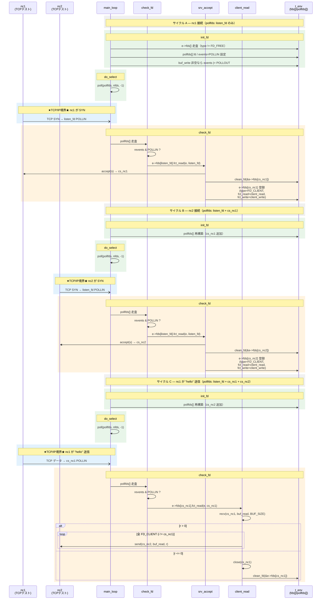
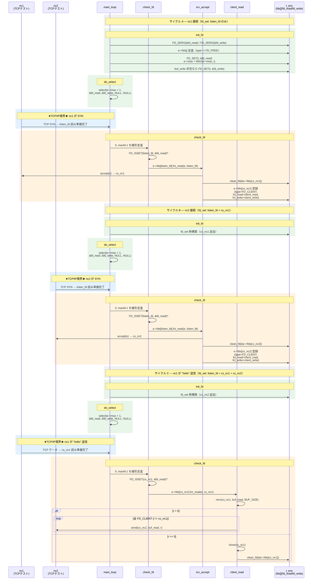

# bircd データフロー図

> 作成日: 2026-06-07
> 用途: bircd 学習資料（main_loop 複数サイクルにまたがるシナリオ、poll 版／select 版の比較）
> 参考スタイル: [`dev_docs/diagrams/data_flow_diagram.md`](../dev_docs/diagrams/data_flow_diagram.md)
> 対象コミット:
> - **poll 版** (現在): `3a969ec feat(bircd): Phase 2 select を poll に置き換え`
> - **select 版** (1 コミット前): `cd88479 Initial commit`（bircd ソースファイルの編集としては直前）

---

## 前提: nc と bircd のプロトコル層

> 本資料を読む前に — bircd は名前に「IRC」とつくが、現状（poll 実装版）は **IRC プロトコルを一切扱わない純粋な TCP relay サーバ**である。課題書添付の bircd 原点は select 版。

### Q1. `nc`（netcat）はどのプロトコル層をサポートするか？

- **トランスポート層**: TCP（デフォルト）/ UDP（`-u` オプション）/ Unix ドメインソケット（`-U`、実装依存）
- **アプリケーション層**: なし。標準入力で受け取ったバイト列をそのまま TCP で送信し、受信したバイト列をそのまま標準出力に流すだけ。**IRC / HTTP / FTP 等の解釈は一切行わない**。

→ つまり `nc` は「TCP/IP の生バイトストリーム送受信ツール」であって IRC クライアントではない。

### Q2. 現在の bircd は IRC プロトコルを使っている？

**使っていない。** `client_read.c` を見れば明らか:

```c
r = recv(cs, e->fds[cs].buf_read, BUF_SIZE, 0);
// 受信したバイト列をそのまま全 FD_CLIENT に送る
i = 0;
while (i < e->maxfd) {
    if ((e->fds[i].type == FD_CLIENT) && (i != cs))
        send(i, e->fds[cs].buf_read, r, 0);
    i++;
}
```

- `NICK` / `USER` / `PASS` / `JOIN` / `PRIVMSG` 等のパースは皆無。`\r\n` 単位の切り出しもなし。
- 純粋な **TCP relay（他クライアントへ転送）**。
- だから「`nc` を 2 つ起動して片方に文字を打つと、もう片方に流れる」という TCP レベルの確認で十分。

### Q3. IRC サーバになるには何を追加する必要がある？

| レイヤ | poll 実装版 bircd が既に提供 | ft_irc 課題で追加 |
|--------|---------------------------|------------------|
| ネットワーク I/O（A 層相当） | poll 多重化 / accept / recv / send / close / 関数ポインタディスパッチ / `buf_read` スロット / POLLOUT 監視の骨格（`buf_write` 非空時） | バッファリングと `\r\n` 切り出し |
| プロトコル（B 層相当） | — | `Parser` / `Message` / `CommandDispatcher` / `ReplyBuilder`（Numeric Reply 生成） |
| アプリ状態（C 層相当） | — | `Client` / `ServerState` / `Channel` / `ChannelModes` |

> ※ poll 実装版の broadcast は `recv` → 即 `send`（`buf_write` / `client_write` 経路は未使用）。課題書添付の bircd 原点は select 版だが、I/O 層の骨格（`buf_*` スロット・`fct_*` ディスパッチ）は共通。

### プロトコルスタック対応表

| レイヤ | `nc` | 現状の bircd | 完成版 ft_irc |
|--------|------|------------|--------------|
| アプリ層（IRC: RFC 1459 / 2812） | ❌ | ❌ | ✅ |
| トランスポート層（TCP） | ✅ | ✅ | ✅ |
| ネットワーク層（IPv4/IPv6） | ✅ | ✅（IPv4） | ✅（v4 or v6） |

→ 本資料で `nc` だけで例示しているのはこの理由による。アプリ層を理解する IRC クライアントを相手にしても bircd 側は**生バイト列としてそのまま broadcast** するだけで、IRC コマンドを処理することはない。

---

## 図 1: 【設計】bircd シーケンス図（poll 版 ＝ 現在）

> 時間軸: `while(1) { init_fd; do_select; check_fd; }` を **3 回**回すシナリオ（nc1 接続 → nc2 接続 → nc1 が "hello" 送信）。各サイクルは `init_fd → poll → check_fd` で完結する。TCP/IP との境界は `nc1` / `nc2` 列を見れば一目でわかる。
>
> 図中の `listen_fd` / `cs_nc1` / `cs_nc2` は説明用ラベル。実装では `s`（listen fd）/ `cs`（accept 戻り値）。
>
> 図はサイクル A から。起動は `init_env → get_opt → srv_create`（図 3 参照）。



---

## 図 2: 【設計】bircd シーケンス図（select 版 ＝ poll 導入前）

> 図 1 と同じ **3 サイクル** シナリオを select API で表現。差分は **`bircd.h`**（`pollfds[]` / `nfds` 追加、`fd_set` コメントアウト）と **`init_fd` / `do_select` / `check_fd`** の 3 `.c`。起動は図 1 と同様、サイクル A の前に `init_env → get_opt → srv_create`（図 3 参照）。



---

## 図 3: 【設計】データフロー（poll 版）

> 静的なモジュール関係と、**1 サイクル分**のデータの流れ。`main_loop` の `while(1)` により `init_fd → do_select → check_fd` が繰り返される（図 1 のサイクル A/B/C 参照）。起動時の `init_env → get_opt → srv_create` はループ外。

```mermaid
flowchart LR
    subgraph startup["起動（1回）"]
        init_env["init_env()<br/>fds[] 確保・全スロット clean_fd"]
        get_opt["get_opt()<br/>argv から port 取得"]
        srv_create["srv_create()<br/>socket/bind/listen"]
    end

    subgraph mux["イベント多重化（毎サイクル）"]
        init_fd["init_fd()<br/>pollfds[] 構築"]
        do_select["do_select()<br/>poll()"]
    end

    subgraph dispatch["ディスパッチ（毎サイクル）"]
        check_fd["check_fd()<br/>revents 判定"]
        fct_read["e->fds[fd].fct_read<br/>(関数ポインタ)"]
        fct_write["e->fds[fd].fct_write<br/>(関数ポインタ)"]
    end

    subgraph netio["ネットワーク I/O"]
        srv_accept["srv_accept()<br/>accept()"]
        client_read["client_read()<br/>recv → broadcast send"]
        client_write["client_write()<br/>(現状 空)"]
    end

    subgraph session["セッション管理（e->fds[]）"]
        env["t_env<br/>fds[], pollfds[], nfds"]
        fd_serv["t_fd (FD_SERV)<br/>fct_read=srv_accept"]
        fd_client["t_fd (FD_CLIENT)<br/>buf_read/buf_write<br/>fct_read=client_read<br/>fct_write=client_write"]
        clean_fd["clean_fd()<br/>type=FD_FREE"]
    end

    init_env --> env
    init_env --> get_opt
    get_opt --> srv_create
    srv_create -->|"listen fd 登録"| fd_serv
    fd_serv -.->|"fds[] の1スロット"| env
    fd_client -.->|"fds[] の1スロット"| env

    init_fd -->|"pollfds[]"| do_select
    do_select -->|"revents"| check_fd
    check_fd -->|"POLLIN"| fct_read
    check_fd -->|"POLLOUT"| fct_write
    fct_read -.->|"FD_SERV"| srv_accept
    fct_read -.->|"FD_CLIENT"| client_read
    fct_write -.->|"FD_CLIENT"| client_write
    srv_accept -->|"clean_fd + 新規 fd 登録"| fd_client
    client_read -->|"r <= 0"| clean_fd
    clean_fd -->|"スロット初期化"| fd_client

    env -->|"type != FD_FREE を走査"| init_fd
    check_fd -->|"while(1) 次サイクル"| init_fd

    style init_env fill:#795548,stroke:#5D4037,color:#fff
    style get_opt fill:#795548,stroke:#5D4037,color:#fff
    style init_fd fill:#50B878,stroke:#3A8A5A,color:#fff
    style do_select fill:#50B878,stroke:#3A8A5A,color:#fff
    style check_fd fill:#F5A623,stroke:#C4841C,color:#fff
    style fct_read fill:#F5A623,stroke:#C4841C,color:#fff
    style fct_write fill:#F5A623,stroke:#C4841C,color:#fff
    style srv_create fill:#4A90D9,stroke:#2E5A8B,color:#fff
    style srv_accept fill:#4A90D9,stroke:#2E5A8B,color:#fff
    style client_read fill:#4A90D9,stroke:#2E5A8B,color:#fff
    style client_write fill:#4A90D9,stroke:#2E5A8B,color:#fff
    style env fill:#795548,stroke:#5D4037,color:#fff
    style fd_serv fill:#795548,stroke:#5D4037,color:#fff
    style fd_client fill:#795548,stroke:#5D4037,color:#fff
    style clean_fd fill:#795548,stroke:#5D4037,color:#fff
    style startup fill:#EFEBE9,stroke:#A1887F
    style mux fill:#E8F5E9,stroke:#81C784
    style dispatch fill:#FFF3E0,stroke:#FFB74D
    style netio fill:#E3F2FD,stroke:#64B5F6
    style session fill:#EFEBE9,stroke:#A1887F
```



---

## poll 版 ⇄ select 版 差分

| 項目 | select 版（`cd88479`） | poll 版（`3a969ec`） |
|------|----------------------|----------------------|
| 監視構造 | `fd_set fd_read; fd_set fd_write;` | `struct pollfd pollfds[MAX_CLIENTS+1]; int nfds;` |
| 構築（`init_fd`） | `FD_ZERO` → 走査して `FD_SET(i, ...)` / `e->max` 更新 | `e->nfds = 0` → 走査して `pollfds[nfds++]` に `fd` と `events` を詰める |
| 待機（`do_select`） | `select(e->max + 1, &fd_read, &fd_write, NULL, NULL)` | `poll(pollfds, nfds, -1)` |
| 発火判定（`check_fd`） | `0..maxfd-1` を走査 + `FD_ISSET(i, &fd_read)`（`e->r > 0` の間 `e->r--`） | `0..nfds-1` を走査 + `pollfds[i].revents & POLLIN` |
| 上限 | `FD_SETSIZE` (典型 1024) | `pollfds[]` は `MAX_CLIENTS+1`（listen 1 + client 42 = 43）。`fds[]` は `maxfd`（`RLIMIT_NOFILE`）。`init_fd` に `nfds` 上限チェック無し |
| 配列の詰め方 | `fds[i]` のインデックスがそのまま fd 番号（疎配列） | `pollfds[]` は使用中 fd のみ詰める（密配列） |
| アプリ側の構造 | `e->fds[fd].type` で判定（変更なし） | 同左（pollfds の `fd` 経由で `e->fds[fd]` 参照） |

**変わらないもの:**
- `t_env::fds[]` / `t_fd`（`type`, `fct_read`, `fct_write`, `buf_read`, `buf_write`）
- 関数ポインタディスパッチ（`fct_read = srv_accept` または `= client_read`）
- ネットワーク I/O 関数（`accept` / `recv` / `send` / `close`）

---

## 主要構造体・データ型

| データ | 型 | 内容 |
|--------|----|------|
| `e->fds[]` | `t_fd *` (配列) | fd 番号インデックスで状態を保持（疎配列） |
| `e->fds[i].type` | `int` | `FD_FREE` / `FD_SERV` / `FD_CLIENT` |
| `e->fds[i].fct_read` | 関数ポインタ | POLLIN 時に呼ばれる（`srv_accept` または `client_read`） |
| `e->fds[i].fct_write` | 関数ポインタ | POLLOUT 時に呼ばれる（`client_write`、現状空） |
| `e->fds[i].buf_read` / `buf_write` | `char[BUF_SIZE+1]` | recv / send バッファ |
| `e->pollfds[]` | `struct pollfd[MAX_CLIENTS+1]` | **(poll版)** poll に渡す監視配列 |
| `e->nfds` | `int` | **(poll版)** pollfds[] 内の使用中件数 |
| `e->fd_read` / `e->fd_write` | `fd_set` | **(select版)** 読み／書き監視ビットマップ |
| `e->max` | `int` | **(select版)** 監視対象 fd 番号の最大値 |
| `e->maxfd` | `int` | `getrlimit(RLIMIT_NOFILE)` で得たプロセス fd 上限 |

---

## 色凡例

| 色 | 機能カテゴリ | 主なファイル / 関数 |
|----|------------|-------------------|
| 🔵 青 | ネットワーク I/O | `srv_create.c` / `srv_accept.c` / `client_read.c` / `client_write.c` |
| 🟢 緑 | イベント多重化 | `init_fd.c` / `do_select.c`（poll または select） |
| 🟠 オレンジ | ディスパッチ | `check_fd.c` / `fct_read` / `fct_write`（関数ポインタ） |
| 🤎 茶 | セッション管理 | `t_env` / `t_fd` / `e->fds[]` / `clean_fd.c` |

---

## 補足: ft_irc（C++ 実装）との対応関係

| bircd | ft_irc 相当（A 層） |
|-------|--------------------|
| `t_env::fds[]`（fd 番号インデックスの疎配列） | `Server::_connections`（`std::map<int, Connection*>`） |
| `t_env::pollfds[]`（固定長 / poll 版） | `Server::_pollfds`（`std::vector<struct pollfd>` 動的） |
| `t_fd::buf_read` / `buf_write` | `Connection::_recvBuffer` / `_sendBuffer` |
| `t_fd::fct_read` / `fct_write`（関数ポインタ） | `Server::_handleRead` / `_handleWrite`（メンバ関数） |
| `srv_accept()` | `Server::_acceptClient()` |
| `client_read()`（即時 broadcast） | `Server::_handleRead()` → B 層 Parser / Dispatcher |
| `clean_fd()` | `Server::_disconnectClient()` |
| 1 行切り出し（未実装） | `Connection::hasCompleteLine()` / `popLine()`（`\r\n` 単位） |
