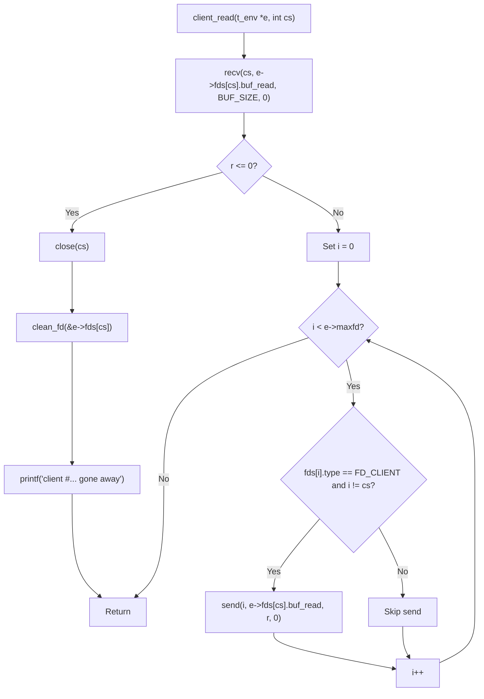

# client_read フローチャート

> 作成日: 2026-06-12
> 対象: [`bircd/client_read.c`](./client_read.c)
> 関連資料: [`bircd_data_flow_diagram.md`](./bircd_data_flow_diagram.md)

## 補足

- `r <= 0` は「切断（r == 0）」と「エラー（r < 0）」の両方を同じ経路で処理する
- broadcast ループは自分自身（`i == cs`）と非クライアント FD をスキップする
- `recv` → 即 `send` の直結。`buf_write` / `client_write` 経路は未使用
