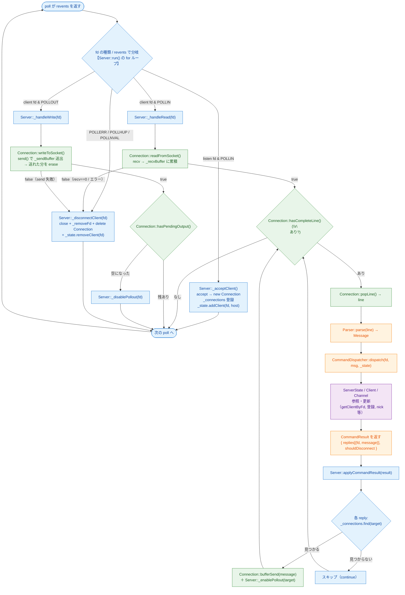
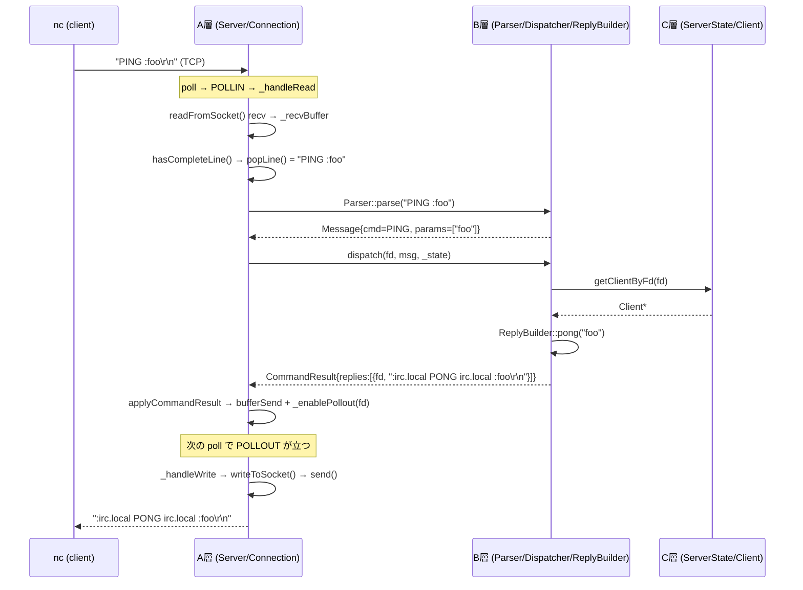

# A 層 I/O フロー（recv → B/C → send 往復）

> 対象: `src/a/Server.{cpp,hpp}` / `src/a/Connection.{cpp,hpp}`
> 1 本の IRC メッセージが `nc`（クライアント）から入り、B 層で解釈され、C 層で状態を参照/更新し、A 層が送り返すまでの往復経路。
> 位置づけ: **レビュー用の補助資料**。粒度は揃っていなくてよく、レビュアーが「どの関数・どのクラス・どの層」を追えることを優先する。

## 図 A: フローチャート（関数・クラス・層を明示）

凡例（ノードの色）:
- 青 = `Server` のメソッド（poll ループ / 接続管理 / 振り分け）
- 緑 = `Connection` のメソッド（fd ごとの recv/send バッファ）
- 橙 = B 層（Parser / CommandDispatcher / ReplyBuilder）
- 紫 = C 層（ServerState / Client / Channel）

### 図 A の読み方（レビュー観点）

- **`Server::run()` の for ループ**が起点。`revents` で `_acceptClient` / `_handleRead` / `_handleWrite` / `_disconnectClient` に振り分ける（青）。
- **受信側**：`_handleRead`（青）が `Connection`（緑）の `readFromSocket → hasCompleteLine → popLine` を回し、取り出した行を B 層（橙）へ渡す。
- **解釈・状態**：B 層（橙）の `dispatch` が C 層（紫）を参照/更新し、`CommandResult` を A 層へ返す。
- **送信準備**：`applyCommandResult`（青）が reply ごとに送信先 `Connection`（緑）の `bufferSend` で積み、`_enablePollout` で POLLOUT を立てる。**ここでは送らない**。
- **送信**：別周回で POLLOUT が立つと `_handleWrite`（青）→ `Connection::writeToSocket`（緑）で `send()` 実行。送り切ったら `_disablePollout`。
- **責務の境界**：青(Server)=poll/接続管理/振り分け、緑(Connection)=fd ごとの recv/send バッファ、橙(B)=解釈、紫(C)=状態。A 層が B/C に依存するのは `Parser::parse` / `dispatch` / `CommandResult` の契約面のみ。

### 図 A の簡略化メモ（図には描かず実装にある挙動）

図はデータフローを優先しているため、以下は図に描いていない。実装（`Server::run()`）では考慮済みなので、図と食い違って見えても矛盾ではない。

1. **revents の判定順**：図では `POLLERR/POLLHUP/POLLNVAL → _disconnectClient` を独立分岐のように描いているが、実コードは 1 周回内で **(3) POLLIN → (3.5) POLLOUT → (4) HUP/ERR の順**に処理する。`POLLIN | POLLHUP` が同時に立つ fd は **先に読み切ってから**切断する（受信バッファに未読が残るのを防ぐ）。
2. **走査中 erase 対策**：`_disconnectClient` は `_pollfds` から要素を `erase` して配列が縮むため、`run()` の添字ループでは切断時に `--i` して添字を戻し、次要素のスキップを防いでいる。

## 図 B: シーケンス図（PING/PONG の時系列）

## 要点

- **`bufferSend` と `send()` は別タイミング**：`applyCommandResult` は `_sendBuffer` に積んで POLLOUT を立てるだけ。実際の `send()` は次の poll 周回の `_handleWrite → writeToSocket` で実行される。
- **POLLOUT の明示トグル**：データを積むとき `_enablePollout`、送り切ったら `_disablePollout`（空 POLLOUT のビジーループ防止）。
- **送信先 fd は source とは限らない**：`applyCommandResult` は `reply.fd` ごとに `_connections.find` して投入（将来のブロードキャスト対応）。
- **層の責務分離**：A は I/O（recv/send/poll/接続管理）のみ。解釈は B、状態は C。
