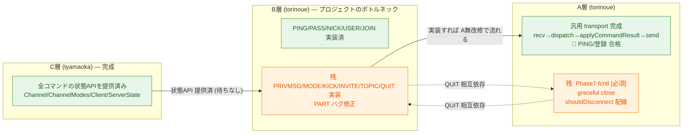

# A・B・C 横断 クリティカルパス / 依存マトリクス

> 作成日: 2026-06-18
> 目的: 「A 層は今どこまでできていて、**B の何を待つ**のか／逆に **A は B・C に何を待たせている**のか」をプロジェクト全体で把握する。PR レビュー時に層をまたいだ残作業とボトルネックを一目で追えるようにする。
> 基準: B/C は `origin/main` 実測（2026-06-18 時点）。

## 関連ドキュメント

| ドキュメント | 役割 |
|---|---|
| 本書 `cross_layer_critical_path.md` | A/B/C 横断の依存・クリティカルパス（残作業とボトルネックの俯瞰） |
| [a_layer_io_flow.md](./a_layer_io_flow.md) | A 層の実行時 I/O フロー（recv→B/C→send 往復、関数・クラス・層を明示した mermaid 図） |
| [a_implementation_plan.md](./a_implementation_plan.md) | A 層単独の実装計画（Phase 0〜8） |
| [../interface.md](../interface.md) | 層間契約の SSOT（A↔B↔C の境界オブジェクトと責務） |

> 補足: 本書と同じ PR で [a_layer_io_flow.md](./a_layer_io_flow.md) も新規作成した（A 層の往復経路をレビュアーが関数単位で追えるようにする補助資料）。本書が「何が残っているか（横断）」、`a_layer_io_flow.md` が「どう動くか（A 層実行時）」という役割分担。

---

## 1. 現在地サマリ

| 層 | 担当 | 到達点 | 残り |
|---|---|---|---|
| A | torinoue | Phase3(受信)/Phase6先行(切断)/送信経路/Phase4(B連携) 完了。🎯 ABC 結合(PING・登録)合格 | **Phase7 ノンブロッキング(fcntl) [必須]**、graceful close、shouldDisconnect 配線、Phase8 仕上げ |
| B | torinoue | PING/PASS/NICK/USER/JOIN 実装。unknown→421 | PRIVMSG/QUIT/KICK/INVITE/TOPIC/MODE 未実装、**PART バグ** |
| C | tyamaoka | 完成（Channel/ChannelModes/Client/ServerState 全 API） | なし |

**重要な構造的事実**: A の送受信経路は**コマンド非依存（generic）**。`_handleRead → Parser→dispatch→applyCommandResult → POLLOUT 送信` は、B が新コマンドを実装すれば **A を改修せず自動で流れる**。例外は QUIT（`shouldDisconnect`）のみ。

---

## 2. コマンド別 依存マトリクス

凡例: ✅=完了 / ⚠️=バグ / ❌=未実装 / —=該当なし

| コマンド | A (transport) | B (dispatch) | C (state API) | クリティカルパス上の待ち |
|---|---|---|---|---|
| PING/PONG | ✅ 汎用経路 | ✅ | — | なし（合格済み） |
| PASS | ✅ | ✅ | ✅ passOk | なし |
| NICK | ✅ | ✅ | ✅ updateNick | なし |
| USER | ✅ | ✅ | ✅ 登録 | なし（welcome 合格済み） |
| JOIN | ✅ ブロードキャスト対応済 | ✅ | ✅ addClientToChannel | なし（A 未テスト→要確認） |
| PART | ✅ | ⚠️ 条件反転/`getChannel` NULL 未チェック | ✅ removeClientFromChannel | **B 修正待ち**。A はテスト回避中 |
| PRIVMSG | ✅ 汎用 | ❌ | ✅ getClientByNick/getMembers | **B 実装待ち**（A 改修不要） |
| QUIT | ⚠️ shouldDisconnect 未配線 | ❌ | ✅ removeClient | **A↔B 相互**（下記 §3） |
| KICK | ✅ 汎用 | ❌ | ✅ isOperator/removeClientFromChannel | **B 実装待ち** |
| INVITE | ✅ 汎用 | ❌ | ✅ inviteClientToChannel/isInvited | **B 実装待ち** |
| TOPIC | ✅ 汎用 | ❌ | ✅ getTopic/setTopic/topicRestricted | **B 実装待ち** |
| MODE (i/t/k/l/o) | ✅ 汎用 | ❌ | ✅ ChannelModes/setOperator | **B 実装待ち** |

---

## 3. 層間の「待ち」関係

### A が B を待つもの
- **基本的に無い**（A は generic transport）。PRIVMSG/KICK/INVITE/TOPIC/MODE は B 実装が入れば A 無改修で流れる。
- 例外的に B の挙動に依存して**テストできない**: PART（B バグ）。A は回避中。

### A が B・C に待たせているもの
- **`shouldDisconnect` 配線（→ B の QUIT を阻害）**: 現状 `applyCommandResult` は `shouldDisconnect` を TODO 放置。B が QUIT を実装して `shouldDisconnect=true` を返しても、**A が切断処理に繋いでいないと QUIT が機能しない**。→ A 側の宿題が B の QUIT 完成のクリティカルパス上にある。
- **C には待たせていない**: A→C は `addClient(fd,host)`/`removeClient(fd)` のライフサイクルのみで配線済み。

### A 単独（B・C 非依存）の必須残作業
- **Phase7 ノンブロッキング (`fcntl(O_NONBLOCK)`)**: 課題評価で必須（未実施は 0 点）。B/C と無関係に進められる。
- graceful close（送信残があるのに HUP で即切断 → flush 後 close）。

---

## 4. クリティカルパス図

図の読み方:
- **C → B**: C は完成済みなので B に状態 API を提供済み（B は C を待たない）。
- **B → A**: B が各コマンドを実装すれば、A の汎用経路を無改修で通って送信される（A は B を待つが、改修は不要）。
- **A ⇢ B（点線・相互）**: QUIT だけは A の `shouldDisconnect` 配線と B の QUIT 実装が両方そろって初めて機能する唯一の相互依存。

---

## 5. ブロッカー / 論点一覧（優先度順）

| # | 論点 | 担当 | 重要度 | 影響 |
|---|---|---|---|---|
| 1 | Phase7 fcntl 未実施 | A | **必須** | 提出要件。評価 0 点回避 |
| 2 | QUIT: B 実装 + A の shouldDisconnect 配線 | A+B | 高 | 切断系の正常動作 |
| 3 | PART バグ（条件反転/`getChannel` NULL） | B | 高 | セグフォ。A はテスト不能 |
| 4 | PRIVMSG 未実装 | B | 高 | チャットの中核機能 |
| 5 | MODE/KICK/INVITE/TOPIC 未実装 | B | 中 | 必須コマンド群 |
| 6 | graceful close（flush 後 close） | A | 中 | 即クローズ時に応答取りこぼし |
| 7 | デバッグ出力/マクロ重複整理 | A | 低 | Phase8 仕上げ |

---

## 6. 結論

- **C は完成**しており全コマンドの状態 API を提供済み → C はクリティカルパス外。
- **A はほぼ汎用経路が完成**しており、残る必須は **Phase7(fcntl)** と **QUIT 用 shouldDisconnect 配線**。それ以外のコマンド追加で A はボトルネックにならない。
- **プロジェクト全体のクリティカルパスは B**（PRIVMSG/MODE/KICK/INVITE/TOPIC/QUIT 実装 + PART 修正）。
- **唯一の A↔B 相互依存は QUIT**（B:QUIT 実装 ↔ A:shouldDisconnect 配線）。ここだけ両者の同期が要る。
