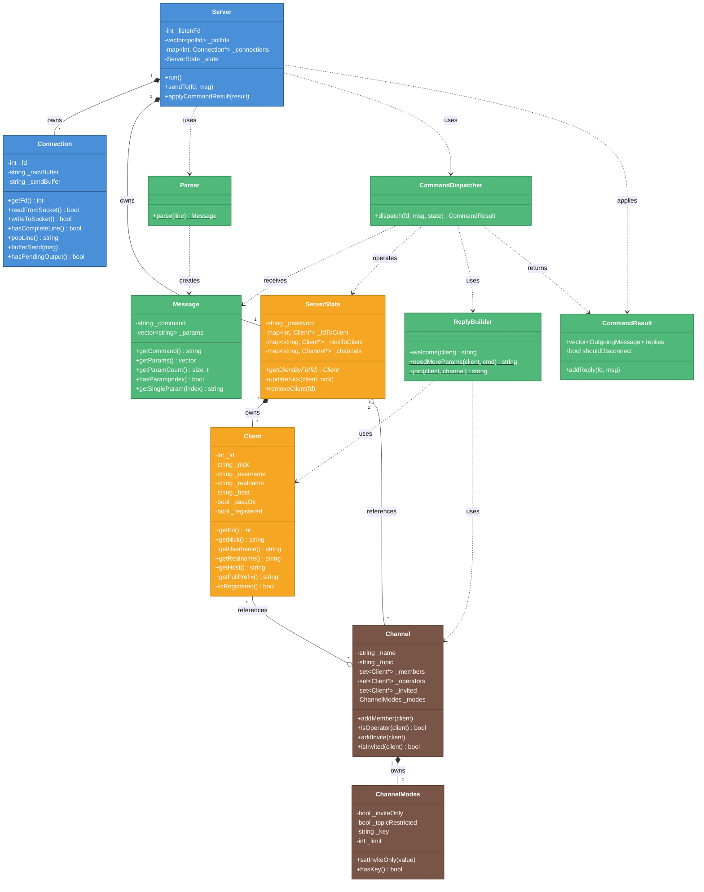

# クラス関係図

> **SSOT (Single Source of Truth)**: 本図が**公開 API とクラス関係**の正式な定義です。
> 他のドキュメントとの差異がある場合、本図を正とします。

> **スコープ**: クラス間の関係性と公開API（`+`）のみ記載。
> プライベートメソッド（`-`ChannelService）は省略。詳細は実装フェーズで決定。
> 契約憲章 → [`interface.md`](../interface.md) / 実装読み物 → [`b_implementation_reader.md`](../b_implementation_reader.md)（SSOT ではない）

> 作成日: 2026-05-23
> 用途: MTG資料（印刷用ペラ1枚）
> 設計原則: [class_diagram_design_principles.md](../learning/class_diagram_design_principles.md) このmdは学習メモ的なものです

---

## 【実装】ircserv クラス構造図

> 詳細設計: クラスは？関係は？

## クラス数と難易度

| 担当  | クラス数            | 主要クラス                                     | 難易度             |
| --- | --------------- | ----------------------------------------- | --------------- |
| A   | 2 (+2 optional) | Server, Connection                        | ★★★ poll/バッファ管理 |
| B   | 4               | Parser, Message, Dispatcher, ReplyBuilder | ★★☆ RFC理解が必要    |
| C1  | 2 (+1 optional) | Client, ServerState                       | ★★☆ 辞書整合性       |
| C2  | 2 (+1 optional) | Channel, ChannelModes                     | ★☆☆ 比較的シンプル     |

### +optional の根拠

| 担当  | Optional クラス                   | 分離条件（design.md Section 3 参照） |
| --- | ------------------------------ | ---------------------------- |
| A   | Poller, ConnectionManager (+2) | poll管理・fd辞書が肥大化した場合          |
| C1  | ClientRegistry (+1)            | ServerState が肥大化した場合         |
| C2  | ChannelService (+1)            | CommandDispatcher が肥大化した場合   |

**方針:** 初期実装では必須クラスのみ。肥大化したら optional を分離。

---

## 色凡例

| 色       | 意味                        |
| ------- | ------------------------- |
| 🔵 青    | A層: Network/IO            |
| 🟢 緑    | B層: Protocol/Command      |
| 🟠 オレンジ | C1層: Client/ServerState   |
| 🤎 茶    | C2層: Channel/ChannelModes |

---

