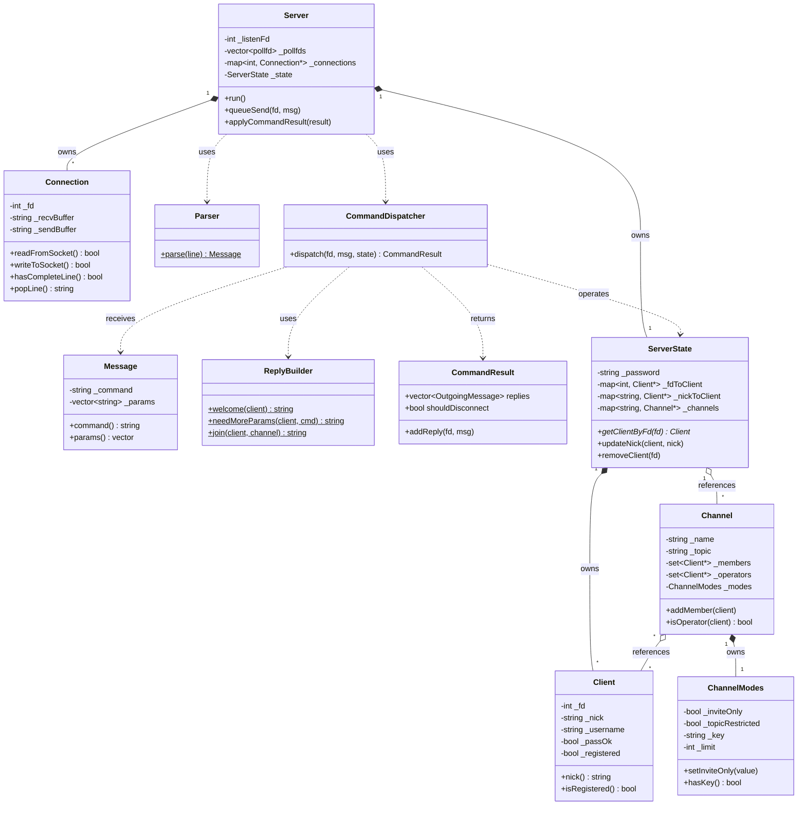
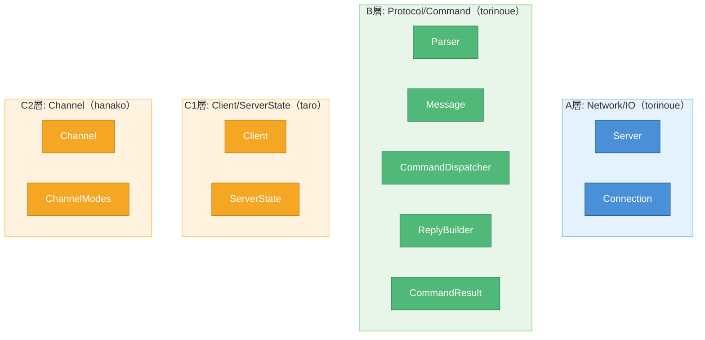

# クラス関係図

> 作成日: 2026-05-23
> 用途: MTG資料（印刷用ペラ1枚）

---

## 全体クラス図

---

## 担当別クラス配置

---

## クラス数と難易度

| 担当 | クラス数 | 主要クラス | 難易度 |
|------|---------|-----------|--------|
| A | 2 (+2 optional) | Server, Connection | ★★★ poll/バッファ管理 |
| B | 4 | Parser, Message, Dispatcher, ReplyBuilder | ★★☆ RFC理解が必要 |
| C1 | 2 (+1 optional) | Client, ServerState | ★★☆ 辞書整合性 |
| C2 | 2 (+1 optional) | Channel, ChannelModes | ★☆☆ 比較的シンプル |

---

## 色凡例

| 色 | 意味 |
|----|------|
| 🔵 青 | A層: Network/IO |
| 🟢 緑 | B層: Protocol/Command |
| 🟠 オレンジ | C1/C2層: アプリケーション状態 |
