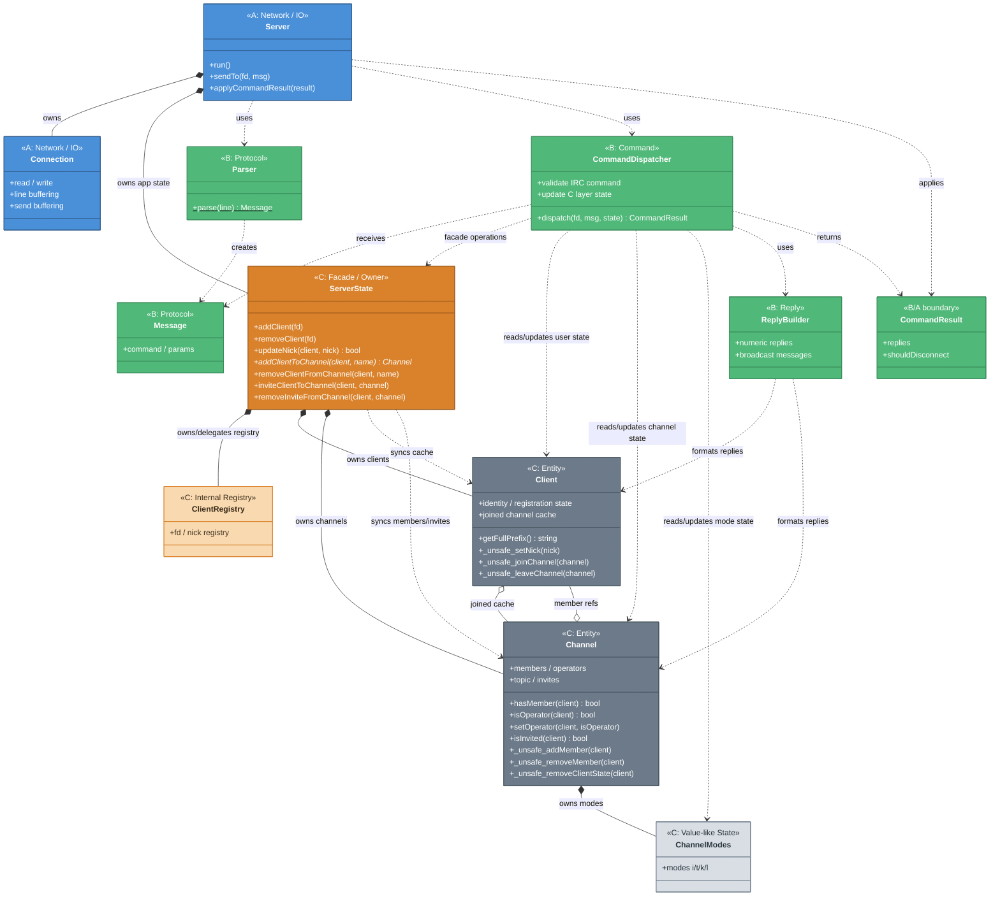

# クラス関係図

> **SSOT (Single Source of Truth)**: 本図は**クラス関係と主要 public API** の正式な定義です。
> 完全な public API 一覧は [`interface.md`](../interface.md) と header を参照します。

> **スコープ**: クラス間の関係性、層間境界に関わる API、不整合防止に重要な API のみ記載。
> private メンバ、private メソッド、単純 getter / setter は原則省略します。Optional クラスは詳細を実装フェーズで決定。
> **SSOT（契約憲章・意図）**: 層間契約の**理由・ルール・設計決定** → [`interface.md`](../interface.md)（本図と同じ契約の別視点。完全な API 一覧は `interface.md` と header を参照）  
> **実装読み物（B層主読者）**: [`b_implementation_reader.md`](../b_implementation_reader.md) — SSOT ではない

> 作成日: 2026-05-23
> 用途: MTG資料（印刷用ペラ1枚）
> 設計原則（オンボ必読）: [class_diagram_design_principles.md](../learning/class_diagram_design_principles.md) — 本図の読み方・SSOT の役割分担

---

## 【実装】ircserv クラス構造図

> 詳細設計: クラスは？関係は？

## クラス数と難易度

| 担当  | クラス数            | 主要クラス                                     | 難易度             |
| --- | --------------- | ----------------------------------------- | --------------- |
| A   | 2 (+2 optional) | Server, Connection                        | ★★★ poll/バッファ管理 |
| B   | 4               | Parser, Message, Dispatcher, ReplyBuilder | ★★☆ RFC理解が必要    |
| C   | 5               | ServerState, ClientRegistry, Client, Channel, ChannelModes | ★★☆ 状態整合性 |

### +optional の根拠

| 担当  | Optional クラス                   | 分離条件（design.md Section 3 参照） |
| --- | ------------------------------ | ---------------------------- |
| A   | Poller, ConnectionManager (+2) | poll管理・fd辞書が肥大化した場合          |
| B/C | ChannelService (+1)            | CommandDispatcher の channel 操作が肥大化した場合 |

**方針:** 初期実装では必須クラスのみ。肥大化したら optional を分離。

---

## 色凡例

| 色       | 意味                         |
| ------- | -------------------------- |
| 🔵 青    | A層: Network/IO             |
| 🟢 緑    | B層: Protocol/Command       |
| 🟠 濃いアンバー | C層: facade / ownership     |
| 🟡 薄いアンバー | C層: internal registry      |
| ⚫ グレー   | C層: entity                 |
| ⚪ 薄いグレー | C層: value-like state       |

---
