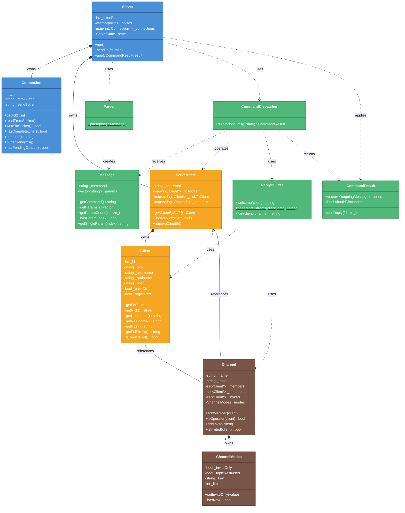
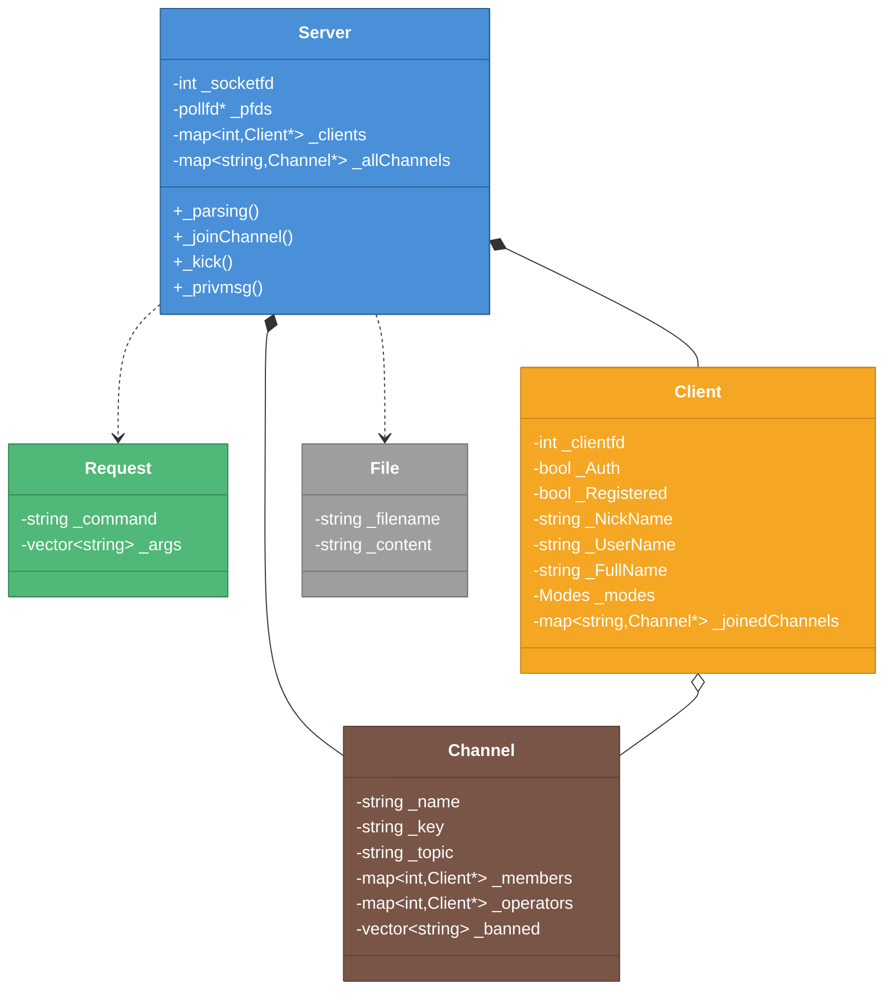
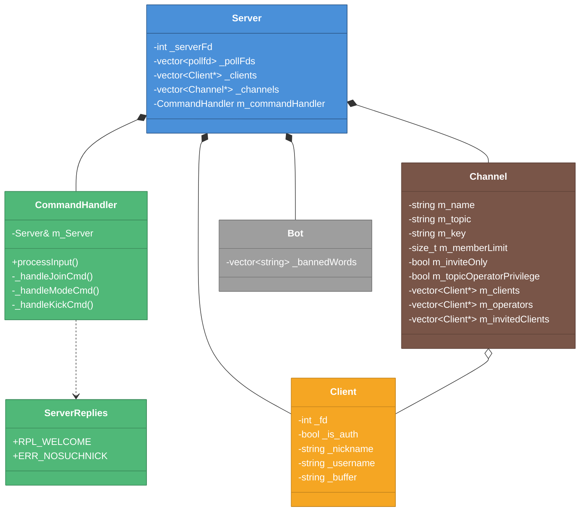
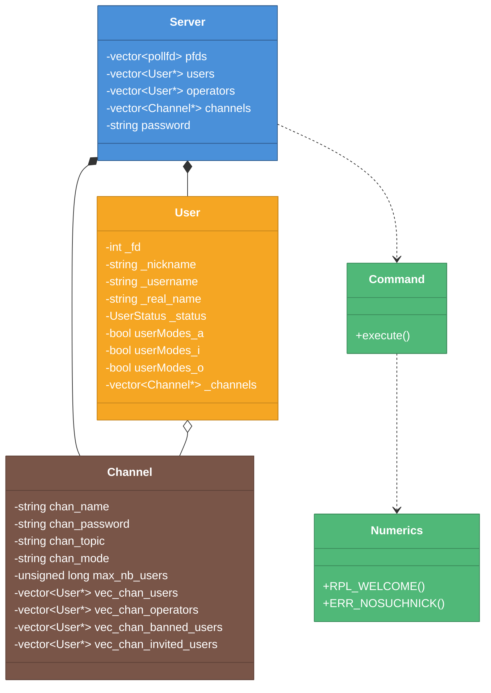
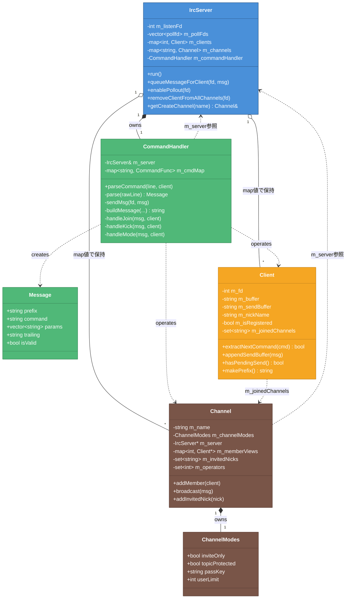

# クラス構造比較図

> 作成日: 2026-05-25
> 更新日: 2026-05-31
> 用途: 外部ft_irc実装との設計比較
> 対象: IRC_torinoue, barimehdi77, itsYakub, Ala-Na, ft_IRC-InternetRelayChat-

---

## 色凡例（全図共通）

| 色 | 意味 |
|----|------|
| 🔵 青 | Network/IO層 |
| 🟢 緑 | Protocol/Command層 |
| 🟠 オレンジ | Client/State層 |
| 🤎 茶 | Channel層 |
| ⚪ グレー | その他/ユーティリティ |

---

## 比較サマリ

| 要素 | IRC_torinoue | barimehdi77 | itsYakub | Ala-Na | ft_IRC-InternetRelayChat- |
|------|:-----------:|:-----------:|:--------:|:------:|:---------------------------:|
| **層分離** | ✅ 4層 | ❌ | ⚠️ 部分的 | ⚠️ 部分的 | ⚠️ 部分的 |
| **Connection** | ✅ | ❌ | ❌ | ❌ | ❌（Client内） |
| **Parser** | ✅ | Request | 内包 | Command | CommandHandler内 |
| **Dispatcher** | ✅ | Server内 | CommandHandler | Command | CommandHandler |
| **ReplyBuilder** | ✅ | Server内 | ServerReplies | Numerics | buildMessage/sendMsg |
| **ServerState** | ✅ | ❌ | ❌ | ❌ | ❌（IrcServer） |
| **InviteList** | ✅ | ❌ | ✅ | ✅ | ✅（nick名） |
| **BannedList** | ❌ | ✅ | ✅ | ✅ | ❌ |
| **送信バッファ** | ✅ Connection | ❌ | ❌ | ❌ | ✅ Client内 |
| **POLLOUT** | ✅ | ❌ | ❌ | ❌ | ✅ |

### 結論

**設計の分かれ目は「B層の分割粒度」と「IOバッファの所在」。**

| パターン | 該当 |
|---------|------|
| 4層分離 + CommandResult | IRC_torinoue（設計） |
| CommandHandler分離 + Server逆参照 | itsYakub, ft_IRC-InternetRelayChat- |
| Serverモノリシック | barimehdi77 |
| namespace + UserStatus | Ala-Na |

**ft_IRC-InternetRelayChat-から参考にできる点（Mandatory Part）:**
- `Client` 内 recv/send バッファ + `enablePollout` — IO堅牢性はIRC_torinoueのConnection設計と同趣旨（A層実装の参考）
- `makePrefix()` — `nick!user@host` 生成（ReplyBuilder へ）
- `removeClientFromAllChannels` — IRC_torinoueでは `removeClient` に内包する方針（`decision_invite_and_removal.md`）

**ft_IRC-InternetRelayChat-のコマンド別ファイル分割（`srcs/commands/`）について:**
- Mandatory Part 固定（約10コマンド・Bonus なし）なら **IRC_torinoue への必須採用は不要**
- `CommandDispatcher` + private method + `ReplyBuilder` 分離で十分。Dispatcher 肥大リスクは低い
- MODE のみ複雑度が高いため、必要なら `ModeHandler.cpp` への**部分分割**は任意

**IRC_torinoue設計の独自点:**
- Connection / ServerState / CommandResult による責務分離
- Server逆参照なし（CommandDispatcher → ServerState 経由）
- Inviteを Client* で管理（nick変更時の整合性を設計側で扱いやすい）
- B層: Parser / CommandDispatcher / ReplyBuilder の3分割（コマンド1ファイル分割は採用しない方針）

---

## 1. IRC_torinoue（設計図）

**特徴:** 4層分離、Connectionクラスあり、ServerState集中管理

---

## 2. barimehdi77/ft_irc

**特徴:** Serverモノリシック、全コマンドをServer内で処理

---

## 3. itsYakub/42-ft_irc

**特徴:** CommandHandler分離、Channel内にinvited管理

---

## 4. Ala-Na/ft_irc

**特徴:** namespace使用、UserStatus enum、詳細なユーザーモード

---

## 5. ft_IRC-InternetRelayChat-

**特徴:** CommandHandlerにParser/Dispatcher/ReplyBuilderを集約、Client内バッファ、送信バッファ+POLLOUT対応

> Mandatory Part中心。Bot・CAP/WHO/WHOIS等の拡張コマンドは図から除外（実装あり）。

**IRC_torinoue設計との主な差分:**

| 観点 | IRC_torinoue | ft_IRC-InternetRelayChat- |
|------|-------------|---------------------------|
| IO分離 | Connectionクラス | Client内 `_buffer` / `_sendBuffer` |
| 状態集約 | ServerState | IrcServerが直接管理 |
| B層分割 | Parser / Dispatcher / ReplyBuilder | CommandHandlerに集約 |
| 返却型 | CommandResult | なし（sendMsgで即バッファ積み） |
| Client/Channel | ポインタ + ServerState | map値（Client/Channel）+ 内部ポインタ参照 |
| Invite管理 | Client* の set | nick名の set |
| コマンド配置 | Dispatcher + private method | `srcs/commands/` 1ファイル1コマンド |

