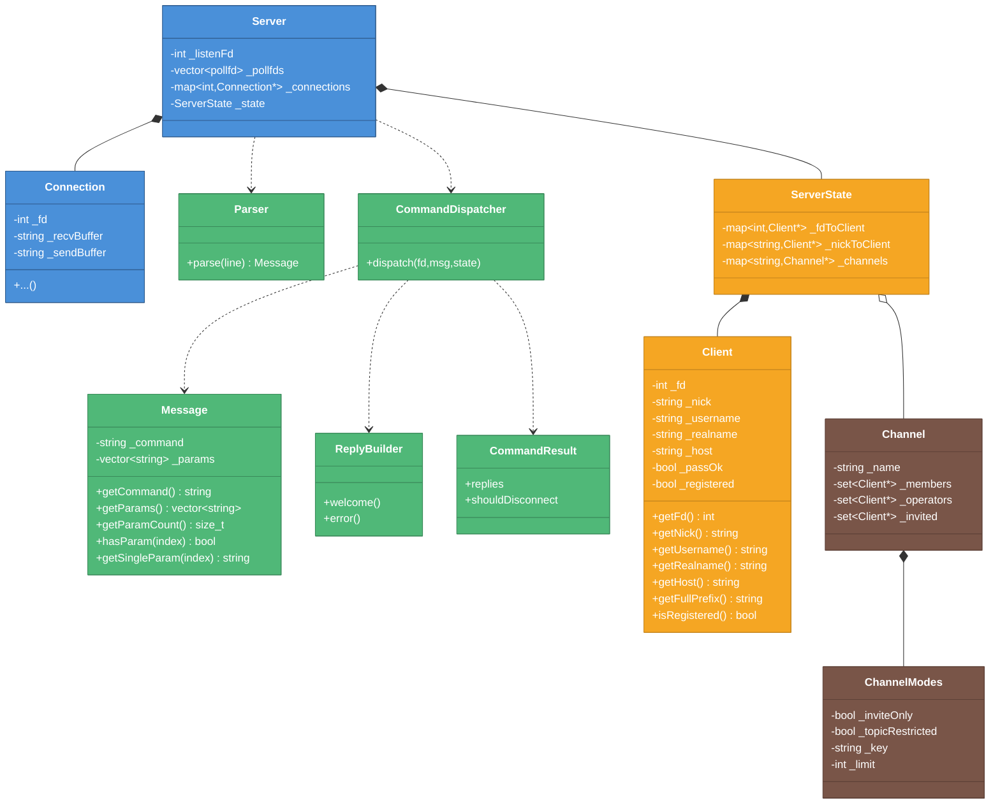
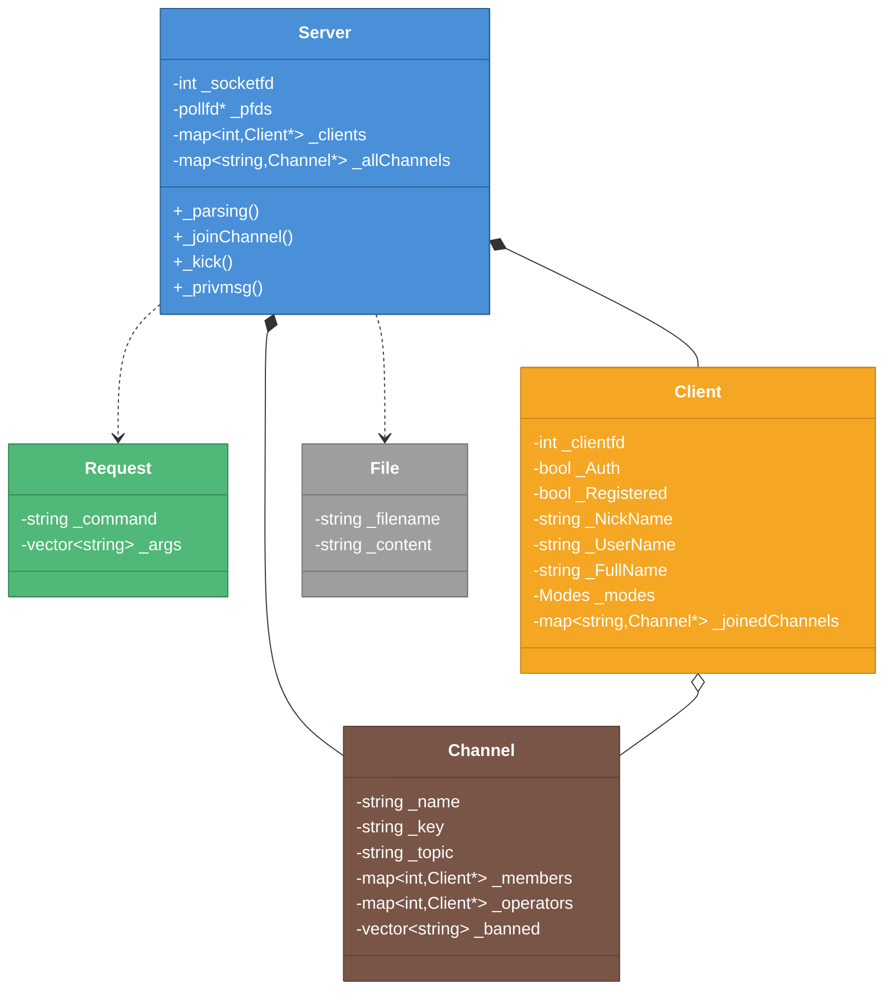
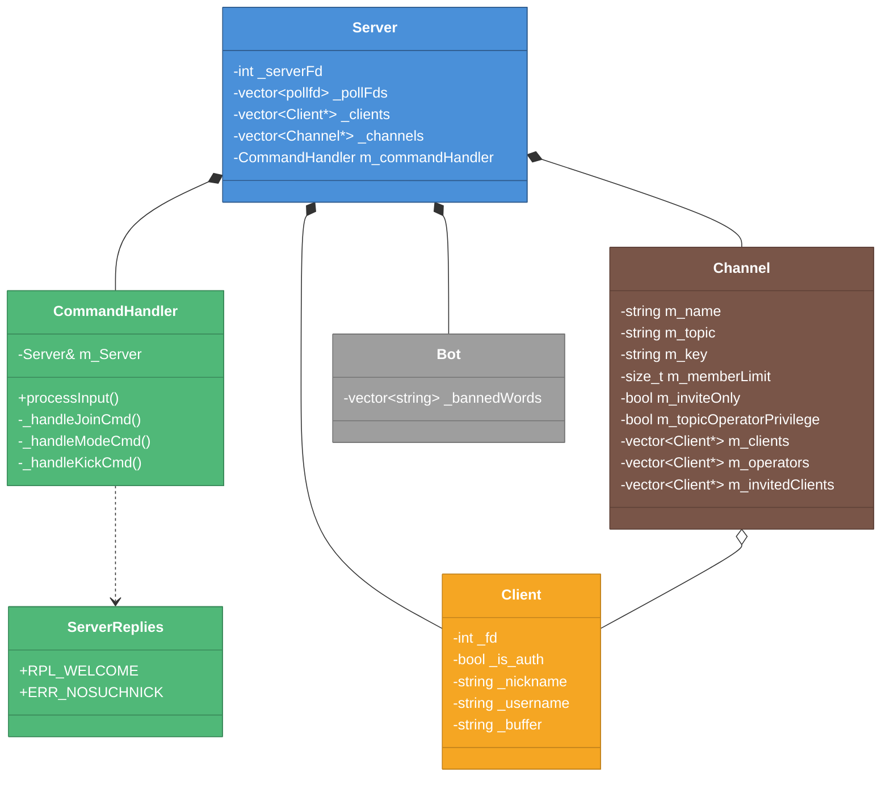
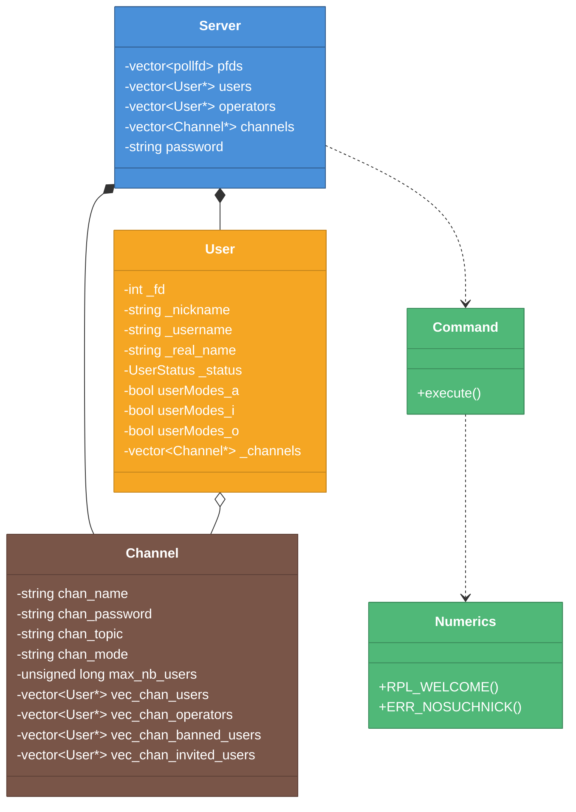

# クラス構造比較図

> 作成日: 2026-05-25
> 更新日: 2026-05-25
> 用途: 外部ft_irc実装との設計比較
> 対象: IRC_torinoue, barimehdi77, itsYakub, Ala-Na

---

## 色凡例（全図共通）

| 色 | 意味 |
|----|------|
| 🔵 青 | Network/IO層 |
| 🟢 緑 | Protocol/Command層 |
| 🟠 オレンジ | Client/State層 |
| 🤎 茶 | Channel層 |
| ⚪ グレー | その他/ユーティリティ |

---

## 1. IRC_torinoue（設計図）

**特徴:** 4層分離、Connectionクラスあり、ServerState集中管理

---

## 2. barimehdi77/ft_irc

**特徴:** Serverモノリシック、全コマンドをServer内で処理

---

## 3. itsYakub/42-ft_irc

**特徴:** CommandHandler分離、Channel内にinvited管理

---

## 4. Ala-Na/ft_irc

**特徴:** namespace使用、UserStatus enum、詳細なユーザーモード

---

## 比較サマリ

| 要素 | IRC_torinoue | barimehdi77 | itsYakub | Ala-Na |
|------|:-----------:|:-----------:|:--------:|:------:|
| **層分離** | ✅ 4層 | ❌ | ⚠️ 部分的 | ⚠️ 部分的 |
| **Connection** | ✅ | ❌ | ❌ | ❌ |
| **Parser** | ✅ | Request | 内包 | Command |
| **Dispatcher** | ✅ | Server内 | CommandHandler | Command |
| **ReplyBuilder** | ✅ | Server内 | ServerReplies | Numerics |
| **ServerState** | ✅ | ❌ | ❌ | ❌ |
| **InviteList** | ✅ | ❌ | ✅ | ✅ |
| **BannedList** | ❌ | ✅ | ✅ | ✅ |

### 結論

**IRC_torinoueの設計は最も層分離が明確。** 他実装はServerが肥大化する傾向。

ただし他実装から学べる点:
- `UserStatus` enum（Ala-Na）: 状態遷移の明示化
- `CommandHandler` 分離（itsYakub）: IRC_torinoueと同じ発想
- `getFullId()` メソッド（itsYakub）: `nick!user@host` 生成
