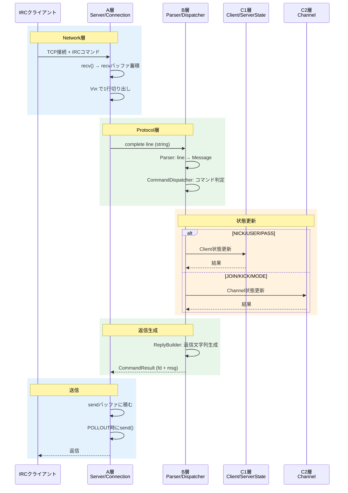
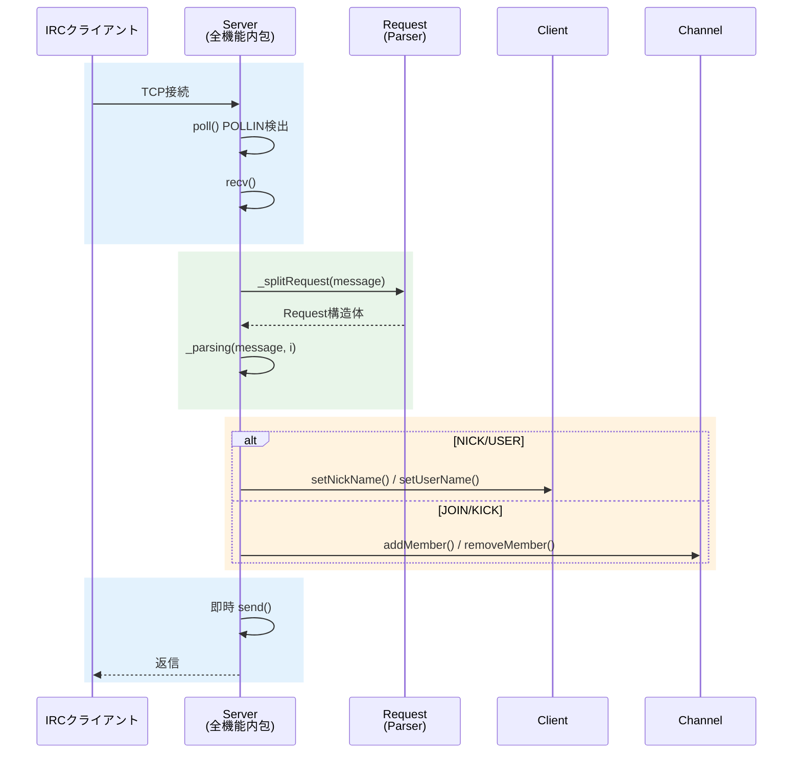
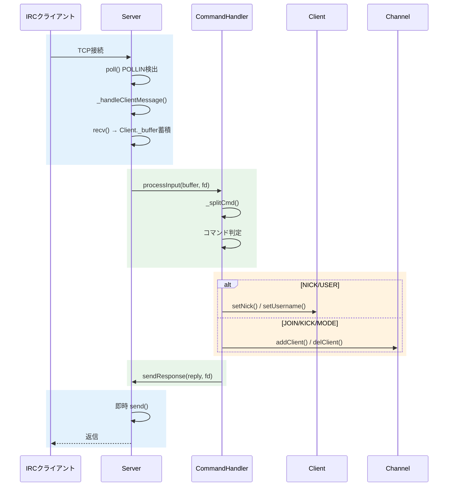
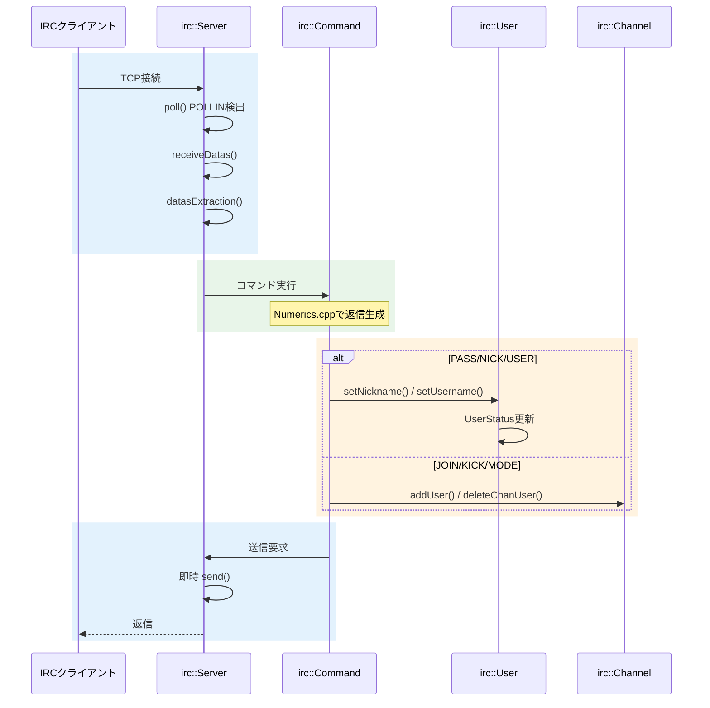

# データフロー比較図

> 作成日: 2026-05-25
> 用途: 外部ft_irc実装とのデータフロー比較
> 対象: IRC_torinoue, barimehdi77, itsYakub, Ala-Na

---

## 色凡例（全図共通）

| 色 | 意味 |
|----|------|
| 🔵 青 | Network/IO層 |
| 🟢 緑 | Protocol/Command層 |
| 🟠 オレンジ | Client/State層 |
| 🤎 茶 | Channel層 |

---

## 1. IRC_torinoue（設計図）

**特徴:** 層間で明確なデータ型を定義、CommandResultで送信を遅延

**データ型:**
- A→B: `std::string` (complete line)
- B内部: `Message` (command + params)
- B→A: `CommandResult` (replies + shouldDisconnect)

---

## 2. barimehdi77/ft_irc

**特徴:** Serverが全処理を内包、即時send()

**データ型:**
- 内部: `Request` (command + args)
- 送信: 即時 `send()` (バッファリングなし)

**問題点:** `send()` がブロックする可能性あり

---

## 3. itsYakub/42-ft_irc

**特徴:** CommandHandler分離、直接send()

**データ型:**
- Client内: `_buffer` (受信バッファをClient内に保持)
- 送信: `Server::sendResponse()` 経由で即時 `send()`

---

## 4. Ala-Na/ft_irc

**特徴:** namespace使用、UserStatus enum、設定ファイル対応

**データ型:**
- `UserStatus` enum: PASS → NICK → USER → REGISTERED
- 送信: 即時 `send()`

---

## 比較サマリ

| 要素 | IRC_torinoue | barimehdi77 | itsYakub | Ala-Na |
|------|:-----------:|:-----------:|:--------:|:------:|
| **受信バッファ位置** | Connection | Server (map) | Client | Server |
| **送信バッファ** | ✅ Connection | ❌ なし | ❌ なし | ❌ なし |
| **CommandResult** | ✅ | ❌ | ❌ | ❌ |
| **POLLOUT対応** | ✅ | ❌ | ❌ | ❌ |
| **即時send()** | ❌ | ✅ | ✅ | ✅ |
| **Parser分離** | ✅ | Request | 内包 | Command |

### 結論

**IRC_torinoueの設計が最も堅牢。**

- 他の全実装は即時 `send()` でブロックリスク
- 送信バッファ + POLLOUT制御があるのはIRC_torinoueのみ
- CommandResultパターンで送信を遅延できる設計
