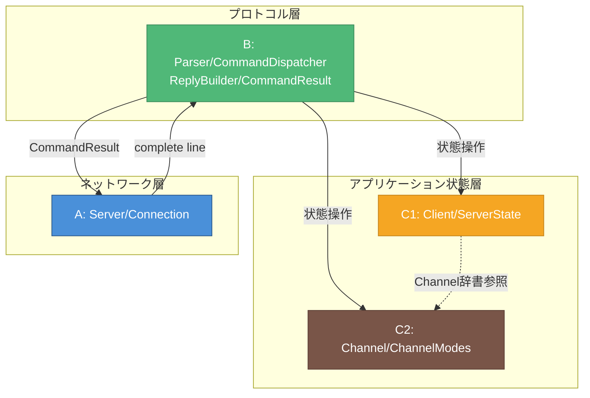
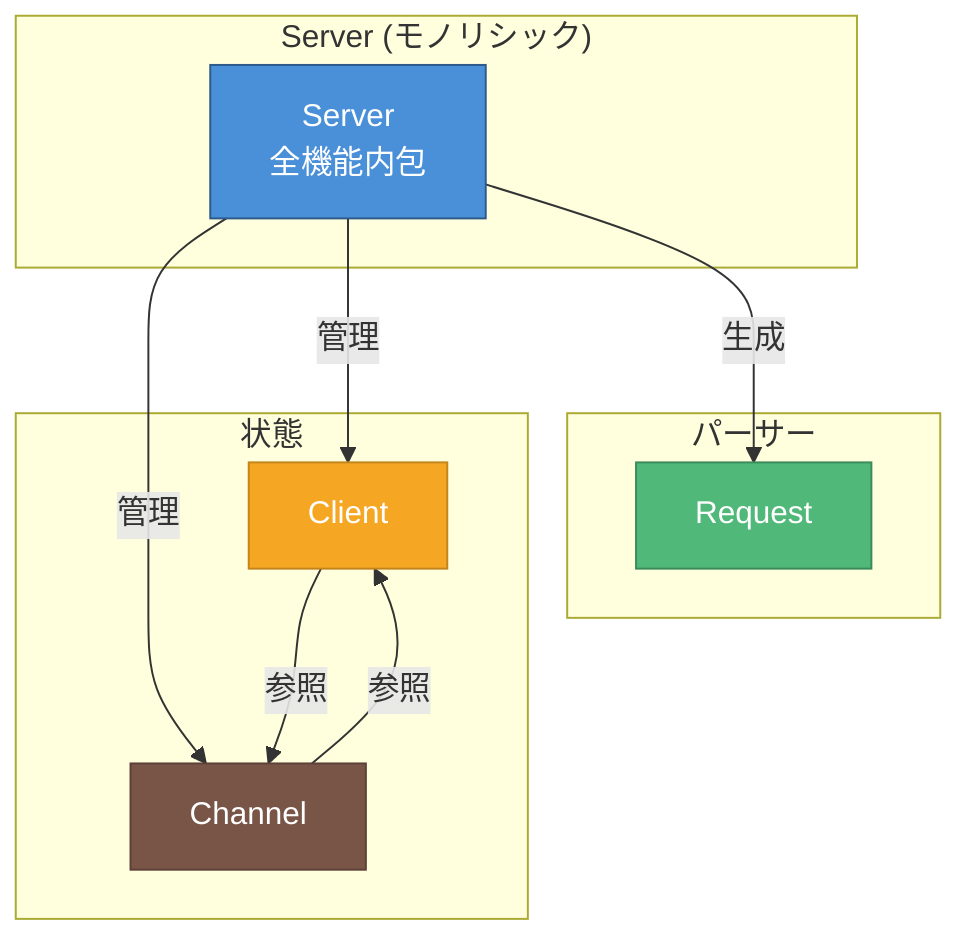
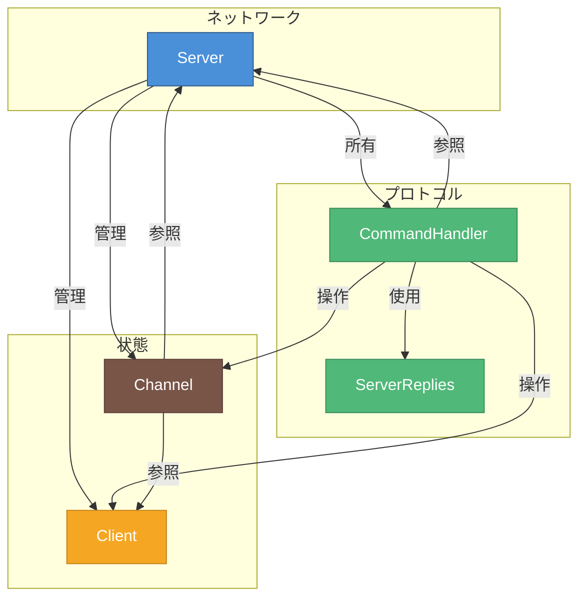
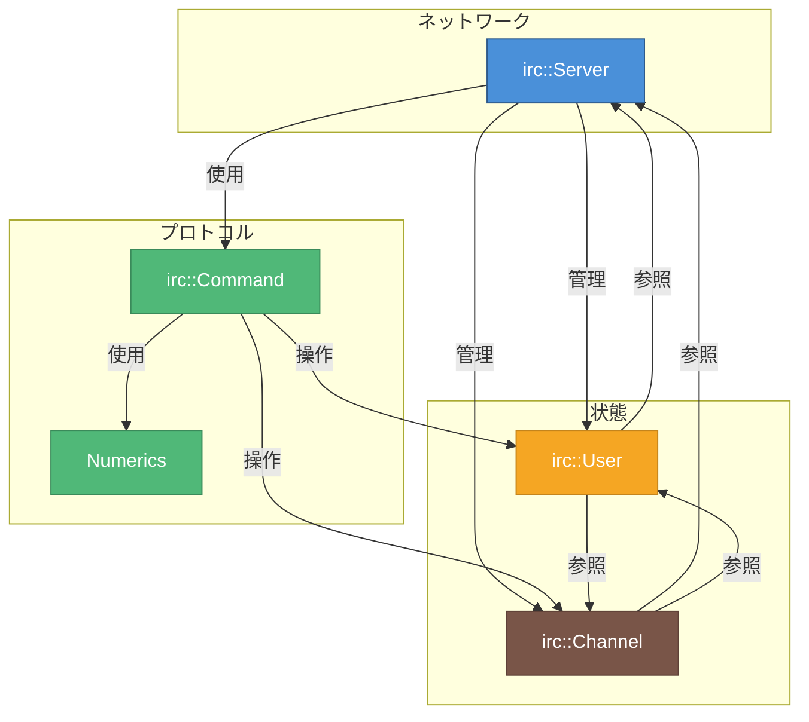
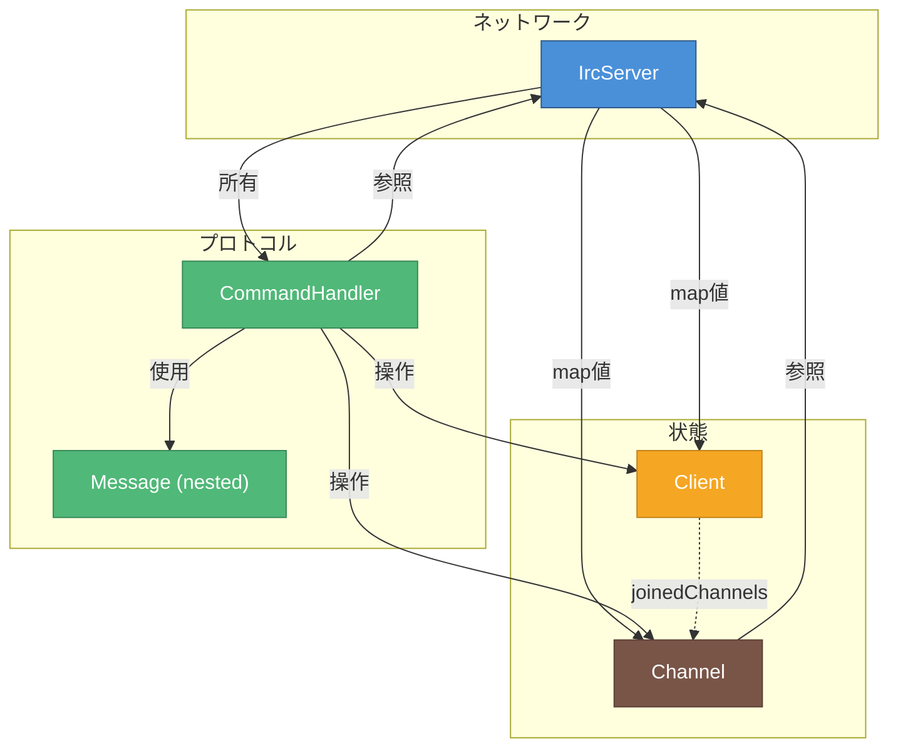

# 依存関係比較図

> 作成日: 2026-05-25
> 更新日: 2026-05-31
> 用途: 外部ft_irc実装との依存関係比較
> 対象: IRC_torinoue, barimehdi77, itsYakub, Ala-Na, ft_IRC-InternetRelayChat-

---

## 色凡例（全図共通）

| 色 | 意味 |
|----|------|
| 🔵 青 | Network/IO層 |
| 🟢 緑 | Protocol/Command層 |
| 🟠 オレンジ | Client/State層 |
| 🤎 茶 | Channel層 |

---

## 1. IRC_torinoue（設計図）

**特徴:** 4層分離、依存方向が明確（上→下のみ）

**依存関係:**
- A → B: 一方向（lineを渡す）
- B → C1/C2: 一方向（状態操作）
- B ← A: CommandResultで返却（逆方向だが疎結合）
- C1 ↔ C2: ServerStateがChannel辞書を持つ

**ブロッカー度:**

| 依存 | 内容 | ブロッカー度 |
|------|------|-------------|
| B → A | complete lineを受け取る | ★★★ |
| B → C1 | Client操作 | ★★☆ |
| B → C2 | Channel操作 | ★★☆ |
| C1 ↔ C2 | 疎結合 | ★☆☆ |

---

## 2. barimehdi77/ft_irc

**特徴:** Serverが中心、強い双方向依存

**依存関係:**
- Server → 全クラス: 強い依存
- Client ↔ Channel: 双方向参照（`_joinedChannels`, `_members`）

**問題点:**
- Serverが肥大化しやすい
- Client/Channel間の循環参照

---

## 3. itsYakub/42-ft_irc

**特徴:** CommandHandler分離、Serverへの逆参照あり

**依存関係:**
- Server → Handler: 所有
- Handler → Server: **逆参照**（`m_Server` メンバ）
- Channel → Server: **逆参照**（`m_server` メンバ）

**問題点:**
- Handler/ChannelがServerに逆依存
- テスト時にServer全体が必要

---

## 4. Ala-Na/ft_irc

**特徴:** namespace使用、User/ChannelがServerを逆参照

**依存関係:**
- User → Server: **逆参照**（`_server` メンバ）
- Channel → Server: **逆参照**（`server` メンバ）
- User ↔ Channel: 双方向参照

**問題点:**
- 全クラスがServerに依存
- 循環参照が多い

---

## 5. ft_IRC-InternetRelayChat-

**特徴:** CommandHandler分離、Client内IOバッファ、Channel/IrcServer双方向参照

> Mandatory Part中心。

**依存関係:**
- IrcServer → CommandHandler: 所有（値メンバ）
- CommandHandler → IrcServer: **逆参照**（`m_server` 参照）
- Channel → IrcServer: **逆参照**（`m_server` ポインタ）
- Client → Channel: チャンネル名のみ（`m_joinedChannels`）、ポインタ双方向なし

**IRC_torinoue設計との差分:**
- ServerState不在 → IrcServerが Client/Channel を直接管理
- CommandResult不在 → Handlerが `sendMsg` / `queueMessageForClient` で直接IO操作
- Client/Channel間は nick名/set ベースで、Client* ↔ Channel の双方向参照より疎

---

## 比較サマリ

| 要素 | IRC_torinoue | barimehdi77 | itsYakub | Ala-Na | ft_IRC-InternetRelayChat- |
|------|:-----------:|:-----------:|:--------:|:------:|:---------------------------:|
| **依存方向** | 一方向 | 双方向 | 双方向 | 双方向 | 双方向（Handler/Channel→Server） |
| **循環参照** | ❌ なし | ✅ あり | ✅ あり | ✅ あり | ⚠️ 限定的 |
| **Server逆参照** | ❌ なし | ❌ なし | ✅ あり | ✅ あり | ✅ あり |
| **層分離** | ✅ 明確 | ❌ | ⚠️ 部分的 | ⚠️ 部分的 | ⚠️ 部分的 |
| **IO非ブロッキング** | ✅ 設計 | ❌ | ❌ | ❌ | ✅ 実装 |

### 依存グラフの複雑さ

| 実装 | エッジ数 | 循環 | 評価 |
|------|---------|------|------|
| IRC_torinoue | 5 | 0 | シンプル（設計） |
| barimehdi77 | 5 | 1 | やや複雑 |
| itsYakub | 8 | 2 | 複雑 |
| Ala-Na | 9 | 3 | 最も複雑 |
| ft_IRC-InternetRelayChat- | 7 | 1 | 中程度（IO堅牢性は高い） |

### 結論

**依存の少なさとIO堅牢性はトレードオフになりうる。**

| 実装 | 依存グラフ | IO |
|------|-----------|-----|
| IRC_torinoue（設計） | 一方向・循環なし | Connection + CommandResult |
| ft_IRC-InternetRelayChat- | Handler/Channel→Server逆参照 | Client内バッファ + POLLOUT（実装済み） |
| barimehdi77 | Server中心・Client↔Channel循環 | 即時send |
| itsYakub / Ala-Na | 逆参照多・循環多 | 即時send |

**ft_IRC-InternetRelayChat-の位置づけ:**
- itsYakub / Ala-Na と同系統（CommandHandler + Server逆参照）
- ただし Client/Channel 間の双方向ポインタ参照は避け、nick名/set で疎に保つ
- IO層だけ IRC_torinoue設計に近い実装を持つ参考例
