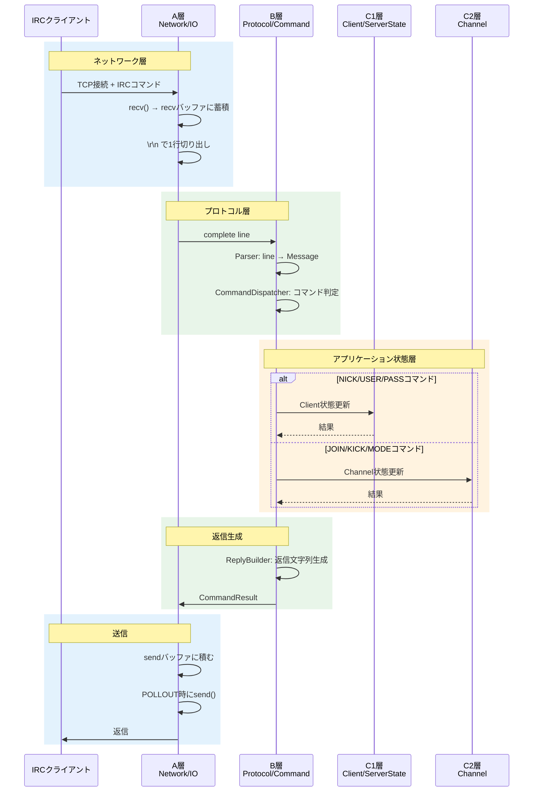
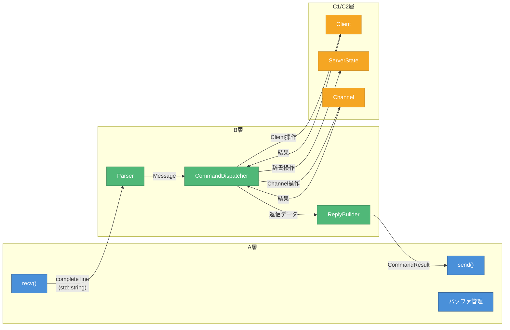

# データフロー図

> 作成日: 2026-05-23
> 用途: MTG資料（印刷用ペラ1枚）

---

## 受信→処理→送信の流れ

---

## 層間インターフェース

---

## 主要データ型

| 境界 | データ型 | 内容 |
|------|----------|------|
| A→B | `std::string` | complete line（`\r\n`除去済） |
| B内部 | `Message` | パース済IRCメッセージ（command, params） |
| B→A | `CommandResult` | 送信先fd + 送信文字列のリスト |
| B↔C1 | `Client*` | ユーザー状態へのポインタ |
| B↔C2 | `Channel*` | チャンネル状態へのポインタ |

---

## 色凡例

| 色 | 意味 |
|----|------|
| 🔵 青 | A層: Network/IO |
| 🟢 緑 | B層: Protocol/Command |
| 🟠 オレンジ | C1/C2層: アプリケーション状態 |
