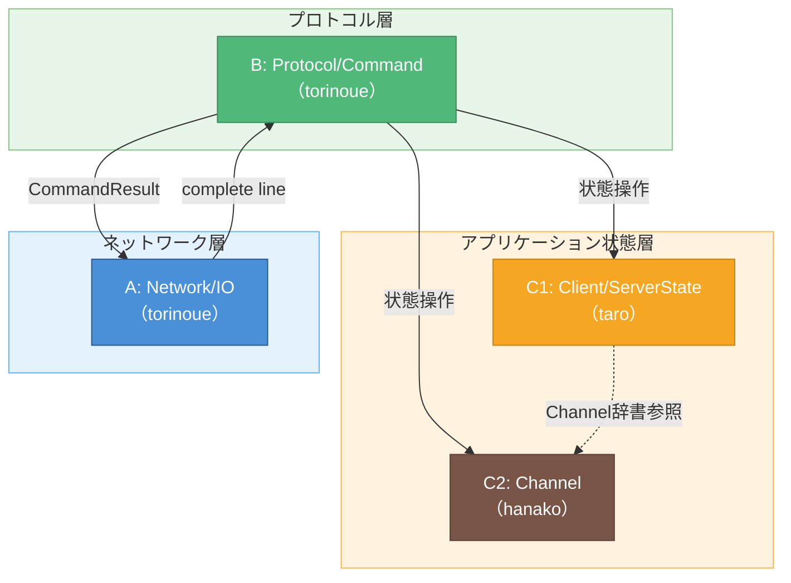
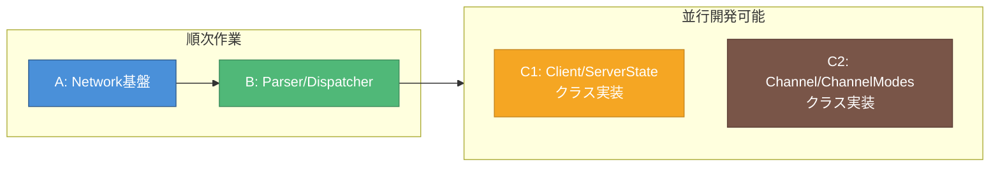

# 担当間依存関係図

> 作成日: 2026-05-23  
> 最終確定: 2026-05-29（Phase 3-4 完了、セッション #0006）  
> 用途: MTG資料（印刷用ペラ1枚）

---

## 実装依存関係
> 【実装】: どのクラスが何に依存するか

---

## 依存関係の詳細

| 依存元 | 依存先 | 内容 | ブロッカー度 |
|--------|--------|------|-------------|
| B | A | complete lineを受け取る | ★★★ Aが先に必要 |
| B | C1 | Client/ServerState操作 | ★★☆ インターフェース合意必要 |
| B | C2 | Channel操作 | ★★☆ インターフェース合意必要 |
| C1 | C2 | ServerStateがChannel辞書を持つ | ★☆☆ 疎結合、後から統合可 |
| A | B | CommandResultを受け取る | ★★☆ インターフェース合意必要 |

---

## 並行開発可能な範囲
> 【開発】: 上記の実装依存関係を前提に、誰がいつ何を作るか

**注:** 【仕様】を満たす範囲で【実装】を変更することで、【開発】のクリティカルパスを短縮できる可能性がある。

---

## 色凡例

| 色 | 意味 |
|----|------|
| 🔵 青 | A層: Network/IO |
| 🟢 緑 | B層: Protocol/Command |
| 🟠 オレンジ | C1層: Client/ServerState |
| 🤎 茶 | C2層: Channel/ChannelModes |
