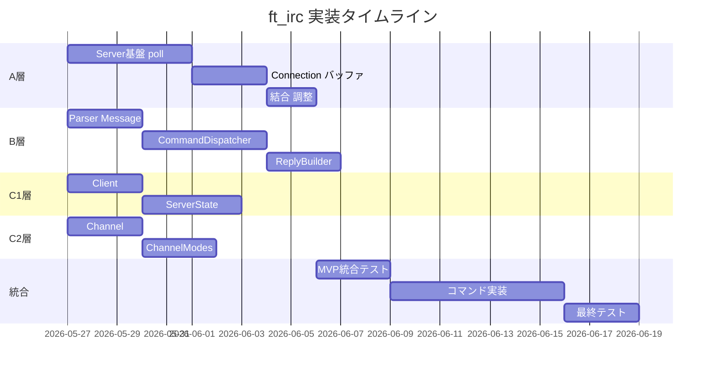
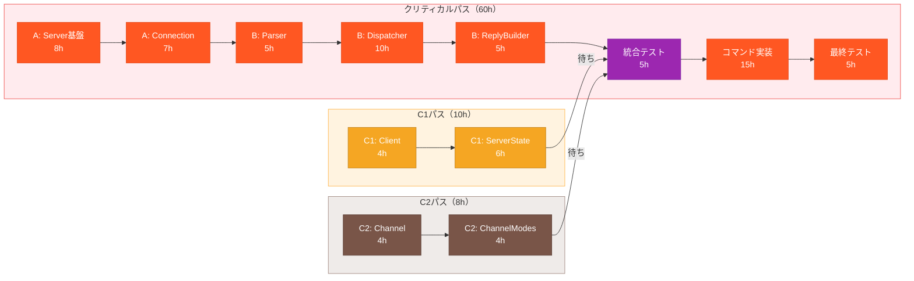
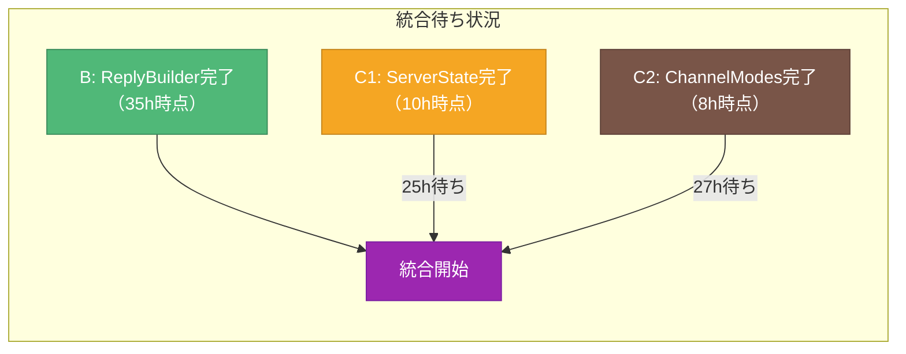

# 実装タイムライン図

> 作成日: 2026-05-23
> 用途: MTG資料（印刷用ペラ1枚）

---

## 実装順序（ガントチャート風）

---

## フェーズ別作業

```mermaid
flowchart LR
    subgraph PHASE1["Phase 1: 基盤"]
        direction TB
        A1["A: Server/poll()"]
        B1["B: Parser/Message"]
        C1_1["C1: Client"]
        C2_1["C2: Channel"]
    end
    
    subgraph PHASE2["Phase 2: 中核"]
        direction TB
        A2["A: Connection"]
        B2["B: Dispatcher"]
        C1_2["C1: ServerState"]
        C2_2["C2: ChannelModes"]
    end
    
    subgraph PHASE3["Phase 3: 統合"]
        direction TB
        MVP["MVP統合<br/>PASS/NICK/USER<br/>JOIN/PRIVMSG"]
    end
    
    subgraph PHASE4["Phase 4: 完成"]
        direction TB
        CMD["全コマンド実装<br/>KICK/INVITE<br/>TOPIC/MODE"]
    end
    
    PHASE1 --> PHASE2
    PHASE2 --> PHASE3
    PHASE3 --> PHASE4

    style A1 fill:#4A90D9,stroke:#2E5A8B,color:#fff
    style A2 fill:#4A90D9,stroke:#2E5A8B,color:#fff
    style B1 fill:#50B878,stroke:#3A8A5A,color:#fff
    style B2 fill:#50B878,stroke:#3A8A5A,color:#fff
    style C1_1 fill:#F5A623,stroke:#C4841C,color:#fff
    style C1_2 fill:#F5A623,stroke:#C4841C,color:#fff
    style C2_1 fill:#795548,stroke:#5D4037,color:#fff
    style C2_2 fill:#795548,stroke:#5D4037,color:#fff
    style MVP fill:#9C27B0,stroke:#7B1FA2,color:#fff
    style CMD fill:#9C27B0,stroke:#7B1FA2,color:#fff
```

---

## 並行作業マトリクス

| Phase | torinoue (A+B) | taro (C1) | hanako (C2) | 並行可能？ |
|-------|----------------|-----------|-------------|-----------|
| 1 | Server基盤, Parser | Client | Channel | ✅ 全員並行 |
| 2 | Connection, Dispatcher | ServerState | ChannelModes | ✅ 全員並行 |
| 3 | 結合・調整 | レビュー | レビュー | ⚠️ torinoue主導 |
| 4 | コマンド実装 | テスト支援 | テスト支援 | ⚠️ torinoue主導 |

---

## クリティカルパス（PDM図）

---

## パス別工数

| パス | タスク | 工数 | 累計 |
|------|--------|------|------|
| **クリティカル** | A: Server基盤 | 8h | 8h |
| | A: Connection | 7h | 15h |
| | B: Parser | 5h | 20h |
| | B: Dispatcher | 10h | 30h |
| | B: ReplyBuilder | 5h | 35h |
| | 統合テスト | 5h | 40h |
| | コマンド実装 | 15h | 55h |
| | 最終テスト | 5h | **60h** |
| **C1パス** | C1: Client | 4h | 4h |
| | C1: ServerState | 6h | **10h** |
| **C2パス** | C2: Channel | 4h | 4h |
| | C2: ChannelModes | 4h | **8h** |

---

## 統合ポイントと待ち関係

**結論:**
- C1/C2は**早期完了**するが、B層完了まで統合待ち
- C1/C2担当者は待ち時間に**レビュー・テスト支援**に回れる
- **ボトルネック: torinoue（A+B）** — ここの遅延が全体に直結

---

## リスクと対策

| リスク | 影響 | 対策 |
|--------|------|------|
| A+B担当の過負荷 | 全体遅延 | C1/C2からのレビュー・テスト支援 |
| インターフェース不一致 | 統合時の手戻り | 早期にinterface.md確認・合意 |
| RFC理解不足 | コマンド仕様誤り | クイズ・チェックリストで確認 |

---

## 色凡例

| 色 | HEX | 意味 |
|----|-----|------|
| 🔴 赤 | #FF5722 | クリティカルパス上のタスク |
| 🟠 オレンジ | #F5A623 | C1層作業（並行パス） |
| 🤎 茶 | #795548 | C2層作業（並行パス） |
| 🟣 紫 | #9C27B0 | 統合ポイント |
| 🟢 緑 | #50B878 | B層完了マイルストーン |
