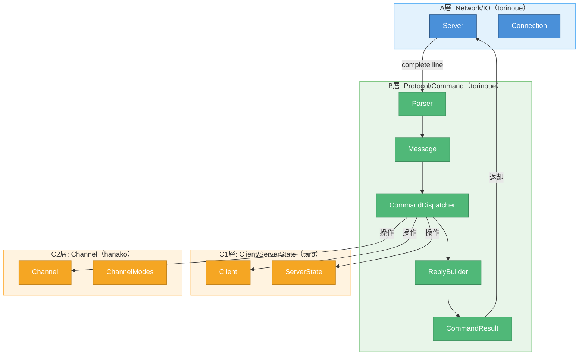

# Interface Prototype（確定版）

> **確定日**: 2026-05-23
> **ベースドキュメント**: [myIRCd/docs/interface.md](../../myIRCd/docs/interface.md)
> **ステータス**: ✅ 確定（MTG用）

---

## チーム構成

| 担当 | メンバー | 範囲 |
|------|---------|------|
| A | torinoue | Network / IO（Server, Connection） |
| B | torinoue | Protocol / Command（Parser, Dispatcher, ReplyBuilder） |
| C1 | taro | Client / ServerState |
| C2 | hanako | Channel / ChannelModes |

---

## 1. 本ドキュメントの位置づけ

- **ベース**: [myIRCd/docs/interface.md](../../myIRCd/docs/interface.md) の全内容を継承
- **目的**: taro/hanako向けのインターフェース確定・合意
- **変更管理**: 本ファイルで追記・修正を管理。元ファイルは変更しない

---

## 2. 担当間依存関係（図解）



---

## 3. C1層インターフェース（taro担当）

> 詳細は [interface.md Section 7](../../myIRCd/docs/interface.md) 参照

### 3.1 Client

| 関数 | 戻り値 | 呼び出し元 | 説明 |
|------|--------|-----------|------|
| `int fd() const` | `int` | B, C2 | fdを取得 |
| `const std::string& nick() const` | `const std::string&` | B, C2 | nickを取得 |
| `const std::string& username() const` | `const std::string&` | B | usernameを取得 |
| `const std::string& realname() const` | `const std::string&` | B | realnameを取得 |
| `void setUsername(const std::string&)` | `void` | B | username設定 |
| `void setRealname(const std::string&)` | `void` | B | realname設定 |
| `void setPassOk(bool)` | `void` | B | PASS成功状態設定 |
| `bool isPassOk() const` | `bool` | B | PASS済みか |
| `bool isRegistered() const` | `bool` | B | 登録完了か |
| `bool canRegister() const` | `bool` | B | 登録可能か（PASS/NICK/USER揃った） |
| `void markRegistered()` | `void` | B | 登録完了にする |

**⚠️ 注意**: `setNick()` は外部から直接呼ばない。`ServerState::updateNick()` を使う。

### 3.2 ServerState

| 関数 | 戻り値 | 呼び出し元 | 説明 |
|------|--------|-----------|------|
| `const std::string& password() const` | `const std::string&` | B | サーバパスワード |
| `void addClient(int fd)` | `void` | Server | Client作成 |
| `void removeClient(int fd)` | `void` | Server, B | Client削除（Channel参照も除去） |
| `Client* getClientByFd(int fd)` | `Client*` | B | fdからClient取得 |
| `Client* getClientByNick(const std::string&)` | `Client*` | B | nickからClient取得 |
| `bool nickExists(const std::string&) const` | `bool` | B | nick重複確認 |
| `void updateNick(Client&, const std::string&)` | `void` | B | nick変更（辞書も更新） |
| `Channel* getChannel(const std::string&)` | `Channel*` | B | Channel取得（なければNULL） |
| `Channel* getOrCreateChannel(const std::string&)` | `Channel*` | B | Channel取得or作成 |
| `void removeChannelIfEmpty(const std::string&)` | `void` | B | 空Channel削除 |

---

## 4. C2層インターフェース（hanako担当）

> 詳細は [interface.md Section 8](../../myIRCd/docs/interface.md) 参照

### 4.1 Channel

| 関数 | 戻り値 | 呼び出し元 | 説明 |
|------|--------|-----------|------|
| `const std::string& name() const` | `const std::string&` | B, C1 | channel名 |
| `bool hasMember(Client*) const` | `bool` | B | 参加済みか |
| `void addMember(Client*)` | `void` | B | member追加 |
| `void removeMember(Client*)` | `void` | B | member削除 |
| `void removeClient(Client*)` | `void` | B, C1 | member/operator/invited一括削除 |
| `std::vector<Client*> members() const` | `std::vector<Client*>` | B | member一覧 |
| `size_t memberCount() const` | `size_t` | B | member数 |
| `bool isOperator(Client*) const` | `bool` | B | operator権限確認 |
| `void addOperator(Client*)` | `void` | B | operator付与 |
| `void removeOperator(Client*)` | `void` | B | operator剥奪 |
| `void invite(Client*)` | `void` | B | 招待リスト追加 |
| `bool isInvited(Client*) const` | `bool` | B | 招待済みか |
| `void removeInvite(Client*)` | `void` | B | 招待解除 |
| `void setTopic(const std::string&)` | `void` | B | topic設定 |
| `const std::string& topic() const` | `const std::string&` | B | topic取得 |
| `ChannelModes& modes()` | `ChannelModes&` | B | mode変更用 |
| `const ChannelModes& modes() const` | `const ChannelModes&` | B | mode参照用 |
| `bool isEmpty() const` | `bool` | B, C1 | member 0人か |

### 4.2 ChannelModes

| 関数 | 戻り値 | 呼び出し元 | 説明 |
|------|--------|-----------|------|
| `bool inviteOnly() const` | `bool` | B | +i状態 |
| `bool topicRestricted() const` | `bool` | B | +t状態 |
| `bool hasKey() const` | `bool` | B | +k状態 |
| `const std::string& key() const` | `const std::string&` | B | パスワード |
| `int limit() const` | `int` | B | 人数制限（-1=無制限） |
| `void setInviteOnly(bool)` | `void` | B | +i/-i設定 |
| `void setTopicRestricted(bool)` | `void` | B | +t/-t設定 |
| `void setKey(const std::string&)` | `void` | B | +k設定 |
| `void unsetKey()` | `void` | B | -k設定 |
| `void setLimit(int)` | `void` | B | +l設定 |
| `void unsetLimit()` | `void` | B | -l設定 |

---

## 5. 重要ルール（必ず守る）

### 5.1 nick変更は ServerState 経由

```cpp
// ❌ NG
client.setNick("newNick");

// ✅ OK
state.updateNick(client, "newNick");
```

### 5.2 Client削除は ServerState 経由

```cpp
// ServerState::removeClient(fd) が自動処理:
// - 全Channelからmember/operator/invited削除
// - fd辞書・nick辞書の更新
// - 空Channelの削除
```

### 5.3 operator権限は Channel が管理

```cpp
// ❌ NG
client.setOperator(true);

// ✅ OK
channel.addOperator(&client);
```

### 5.4 Channel は Client を所有しない

- `Channel` は `Client*` を保持するだけ
- `delete` は `ServerState` の責務

---

## 6. 境界オブジェクト

### 6.1 CommandResult

B層からA層への戻り値。送信先fdと送信文字列を保持。

```cpp
struct CommandResult {
    std::vector<OutgoingMessage> replies;
    bool shouldDisconnect;
    
    void addReply(int fd, const std::string& message);
};
```

### 6.2 OutgoingMessage

```cpp
struct OutgoingMessage {
    int         fd;
    std::string message;
};
```

---

## 7. 未確定事項（Open Questions）

| 項目 | 現状 | 決定タイミング |
|------|------|---------------|
| Poller分離 | optional | 実装時判断 |
| ConnectionManager分離 | optional | 実装時判断 |
| ClientRegistry分離 | optional | 実装時判断 |
| ChannelService分離 | optional | 実装時判断 |

---

## 8. 関連ドキュメント

| ドキュメント | 内容 |
|-------------|------|
| [myIRCd/docs/interface.md](../../myIRCd/docs/interface.md) | ベースドキュメント（詳細） |
| [myIRCd/docs/design.md](../../myIRCd/docs/design.md) | 全体設計・責務分割 |
| [onboarding_C1.md](./onboarding_C1.md) | taro向けオンボーディング |
| [onboarding_C2.md](./onboarding_C2.md) | hanako向けオンボーディング |
| [team_roles.md](./team_roles.md) | チーム役割分担 |

---

## 変更履歴

| 日付 | 内容 |
|------|------|
| 2026-05-23 | 初版作成。myIRCd/docs/interface.md ベースに担当者割当追加 |
