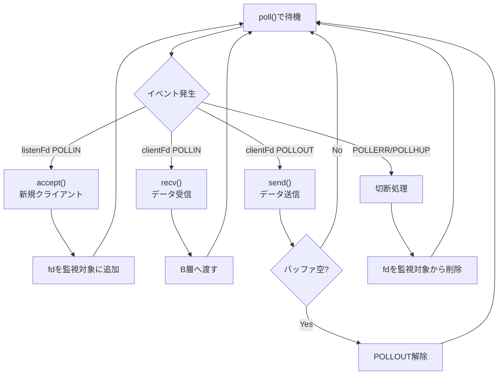

# オンボーディング: A担当（Network / IO）

> 作成日: 2026-05-24
> 対象: A担当（Server, Connection）
> 所要時間: 約30分で読める

---

## 1. IRCとは

- **Internet Relay Chat** の略。1988年生まれのテキストチャットプロトコル
- 1つのサーバーに複数クライアントが接続し、チャンネル（部屋）で会話する
- Slack/Discordの先祖。今も使われている

---

## 2. ft_irc課題の目標

**C++98でIRCサーバーを作る。**

できるようになること:

- irssi（IRCクライアント）から接続できる
- ユーザー登録（PASS/NICK/USER）ができる
- チャンネルに入って会話できる（JOIN/PRIVMSG）
- オペレーター機能（KICK/INVITE/TOPIC/MODE）が動く

---

## 3. 全体アーキテクチャ（4層）

OSI参照モデル準拠: アプリケーション層（抽象度高）が上、ネットワーク層（低レイヤー）が下。

```
┌───────────────────────────────────────────────────────┐
│            アプリケーション状態層                      │
│  ┌─────────────────────┐  ┌─────────────────────┐    │
│  │ C1: Client/State    │  │ C2: Channel         │    │
│  └─────────────────────┘  └─────────────────────┘    │
├───────────────────────────────────────────────────────┤
│  B層: Protocol / Command                              │
│  IRCメッセージ解析、コマンド実行、返信生成             │
├───────────────────────────────────────────────────────┤
│  A層: Network / IO ★君の担当★                        │
│  socket, poll(), recv/send, バッファ管理              │
└───────────────────────────────────────────────────────┘
         ↑↓ TCP接続
    ┌──────────┐
    │ IRCクライアント（irssi等）
    └──────────┘
```

**データの流れ（上向き: 受信 / 下向き: 送信）:**

```
[受信] クライアント → A層(recv) → B層(parse/dispatch) → C1/C2層(状態更新)
[送信] C1/C2層 → B層(reply生成) → A層(send) → クライアント
```

---

## 4. 君の担当: A層

### 担当クラス


| クラス               | 役割                           | 必須/Optional |
| ----------------- | ---------------------------- | ----------- |
| **Server**        | サーバー起動、メインループ、イベント振り分け       | 必須          |
| **Connection**    | fd、recv/sendバッファ、ノンブロッキング送受信 | 必須          |
| Poller            | pollfd配列管理、POLLIN/POLLOUT制御  | Optional    |
| ConnectionManager | fd→Connection辞書管理            | Optional    |


### A層が「やること」

```cpp
// 以下を実装する
socket()      // TCPソケット作成
bind()        // ポートにバインド
listen()      // 接続待機
accept()      // 新規接続受付
recv()        // データ受信（ノンブロッキング）
send()        // データ送信（ノンブロッキング）
poll()        // I/O多重化
fcntl()       // ノンブロッキング設定
```

### A層が「やらないこと」

```cpp
// 以下はB層/C層の責務
PASS判定      // B層
NICK処理      // B層 + C1層
JOIN処理      // B層 + C2層
PRIVMSG配送   // B層
MODE解釈      // B層 + C2層
```

---

## 5. 重要概念: poll() ループ




### 重要ルール

1. **poll() 呼び出しは1箇所だけ** - Server.run() 内で1回だけ
2. **全てノンブロッキング** - accept/recv/send 全てに O_NONBLOCK
3. **POLLOUT は動的制御** - sendバッファに未送信データがある時だけ監視

---

## 6. 重要概念: バッファリング

### なぜバッファが必要か？

TCPはバイトストリーム。メッセージ境界は保持されない。

```
送信: "NICK foo\r\nUSER bar ...\r\n"
       ↓ TCP（バイトストリーム）
recv 1回目: "NICK fo"
recv 2回目: "o\r\nUS"
recv 3回目: "ER bar ...\r\n"
```

→ **受信バッファに蓄積して `\r\n` で切り出す必要がある**

### バッファ構造

```cpp
class Connection {
    int         _fd;
    std::string _recvBuffer;  // 受信データ蓄積
    std::string _sendBuffer;  // 送信待ちデータ
};
```

### 処理フロー

```
recv() → _recvBuffer に追記
         ↓
         \r\n があれば1行切り出し → B層へ渡す
         ↓
         残りは _recvBuffer に残す

B層から返信 → _sendBuffer に追記
              ↓
              POLLOUT 監視開始
              ↓
send() → _sendBuffer から送信
         ↓
         全部送れたら POLLOUT 監視解除
```

---

## 7. A層とB層の境界

### A層 → B層

```cpp
// A層が提供するもの
std::string completeLine;  // "\r\n" 除去済みの1行

// B層に渡す
Message msg = Parser::parse(completeLine);
CommandResult result = dispatcher.dispatch(fd, msg, state);
```

### B層 → A層

```cpp
// B層が返すもの
struct CommandResult {
    std::vector<OutgoingMessage> replies;  // 送信先fd + 送信文字列
    bool shouldDisconnect;                  // 切断要求
};

// A層が処理
for (each reply in result.replies) {
    connection->queueSend(reply.message);  // sendバッファに積む
}
```

**重要: B層は send() を直接呼ばない。CommandResult を返すだけ。**

---

## 8. 読むべきドキュメント（この順番で）


| 順序  | ファイル                           | 内容                          | 時間目安 |
| --- | ------------------------------ | --------------------------- | ---- |
| 1   | **このファイル**                     | 全体像把握                       | 10分  |
| 2   | `reading_guide_common.md`      | 共通概念、データフロー図                | 10分  |
| 3   | `bircd_learning_curriculum.md` | bircd → Server.cpp 学習プラン    | 30分  |
| 4   | `design.md` Section 3.1, 5     | Network/IO層、Connectionの詳細設計 | 20分  |
| 5   | `interface.md` Section 5       | Server/Connectionの関数一覧      | 15分  |
| 6   | `reading_guide_A.md`           | A担当向け詳細ガイド                  | 10分  |
| 7   | `myIRCd/src/Server.cpp`        | 参考実装（poll()サンプル）            | 30分  |


**書籍（必須）:**

- 「TCP/IPソケットプログラミング C言語編」
- 2章（TCP基礎）、5.3.1（ノンブロッキング）、5.5（多重化）、6章（バッファリング）

---

## 9. よくある疑問

### Q: ConnectionとClientの違いは？

**A:** 

- `Connection`（A層）: TCP接続そのもの。recv/sendバッファを持つ
- `Client`（C1層）: IRCユーザーの論理状態。nick/username等を持つ

両者はfdで紐づくが、責務は分離。

### Q: なぜ POLLOUT を常時監視しない？

**A:** 送信バッファが空の時に POLLOUT を監視すると、毎回イベントが発生して無駄なCPU消費になるため。未送信データがある時だけ監視する。

### Q: EAGAIN が返ったらどうする？

**A:** エラーではない。「今はデータがない」という意味。切断せず、次の poll() を待つ。

### Q: 書籍は select() なのに poll() を使う理由は？

**A:** select() は fd 数上限（FD_SETSIZE=1024）がある。poll() には上限がない。2003年当時 Windows で poll() 未サポートだったため書籍は select() を使っている。

### Q: Poller と ConnectionManager は最初から実装する？

**A:** Optional。最初は Server 内に埋め込んでOK。肥大化したら分離する。