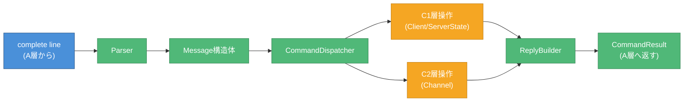

# オンボーディング: B担当（Protocol / Command）

> 作成日: 2026-05-24
> 対象: B担当（Parser, Message, CommandDispatcher, ReplyBuilder）
> 所要時間: 約30分で読める

---

## 1. IRCとは

- **Internet Relay Chat** の略。1988年生まれのテキストチャットプロトコル
- 1つのサーバーに複数クライアントが接続し、チャンネル（部屋）で会話する
- Slack/Discordの先祖。今も使われている

---

## 2. ft_irc課題の目標

**C++98でIRCサーバーを作る。**

できるようになること:
- irssi（IRCクライアント）から接続できる
- ユーザー登録（PASS/NICK/USER）ができる
- チャンネルに入って会話できる（JOIN/PRIVMSG）
- オペレーター機能（KICK/INVITE/TOPIC/MODE）が動く

---

## 3. 全体アーキテクチャ（4層）

OSI参照モデル準拠: アプリケーション層（抽象度高）が上、ネットワーク層（低レイヤー）が下。

```
┌───────────────────────────────────────────────────────┐
│            アプリケーション状態層                      │
│  ┌─────────────────────┐  ┌─────────────────────┐    │
│  │ C1: Client/State    │  │ C2: Channel         │    │
│  └─────────────────────┘  └─────────────────────┘    │
├───────────────────────────────────────────────────────┤
│  B層: Protocol / Command ★君の担当★                  │
│  IRCメッセージ解析、コマンド実行、返信生成             │
├───────────────────────────────────────────────────────┤
│  A層: Network / IO                                    │
│  socket, poll(), recv/send, バッファ管理              │
└───────────────────────────────────────────────────────┘
         ↑↓ TCP接続
    ┌──────────┐
    │ IRCクライアント（irssi等）
    └──────────┘
```

**データの流れ（上向き: 受信 / 下向き: 送信）:**
```
[受信] クライアント → A層(recv) → B層(parse/dispatch) → C1/C2層(状態更新)
[送信] C1/C2層 → B層(reply生成) → A層(send) → クライアント
```

---

## 4. 君の担当: B層

### 担当クラス

| クラス | 役割 |
|--------|------|
| **Message** | パース済みIRCメッセージ構造体（command, params） |
| **Parser** | 1行文字列 → Message 変換 |
| **CommandDispatcher** | コマンド判定、処理実行、CommandResult 返却 |
| **ReplyBuilder** | Numeric Reply、エラー、通知メッセージの文字列生成 |

### B層の処理フロー



---

## 5. IRCメッセージフォーマット

### 基本構造

```
[:<prefix>] <command> [<params>] [:<trailing>]\r\n
```

### 例

```
NICK foo                          → command="NICK", params=["foo"]
USER bar 0 * :Real Name           → command="USER", params=["bar","0","*","Real Name"]
PRIVMSG #room :hello world        → command="PRIVMSG", params=["#room","hello world"]
:nick!user@host PRIVMSG #ch :hi   → prefix="nick!user@host", command="PRIVMSG", params=["#ch","hi"]
```

### Message 構造体

```cpp
class Message {
    std::string              _command;   // "NICK", "JOIN", etc.
    std::vector<std::string> _params;    // パラメータ配列
};
```

**注意:** `:` で始まる trailing は `_params` の最後の要素として扱う。

---

## 6. 実装するコマンド

### 登録系（C1層を操作）

| コマンド | 動作 | 例 | [RFC 1459](https://www.rfc-editor.org/rfc/rfc1459) | [RFC 2812](https://www.rfc-editor.org/rfc/rfc2812) |
|----------|------|-----|----------|----------|
| `PASS` | パスワード認証 | `PASS secretpass` | [4.1.1](https://www.rfc-editor.org/rfc/rfc1459#section-4.1.1) | [3.1.1](https://www.rfc-editor.org/rfc/rfc2812#section-3.1.1) |
| `NICK` | ニックネーム設定 | `NICK foo` | [4.1.2](https://www.rfc-editor.org/rfc/rfc1459#section-4.1.2) | [3.1.2](https://www.rfc-editor.org/rfc/rfc2812#section-3.1.2) |
| `USER` | ユーザー情報設定 | `USER foo 0 * :Real Name` | [4.1.3](https://www.rfc-editor.org/rfc/rfc1459#section-4.1.3) | [3.1.3](https://www.rfc-editor.org/rfc/rfc2812#section-3.1.3) |

### チャンネル系（C2層を操作）

| コマンド | 動作 | 例 | [RFC 1459](https://www.rfc-editor.org/rfc/rfc1459) | [RFC 2812](https://www.rfc-editor.org/rfc/rfc2812) |
|----------|------|-----|----------|----------|
| `JOIN` | チャンネル参加 | `JOIN #room` | [4.2.1](https://www.rfc-editor.org/rfc/rfc1459#section-4.2.1) | [3.2.1](https://www.rfc-editor.org/rfc/rfc2812#section-3.2.1) |
| `PART` | チャンネル退出 | `PART #room` | [4.2.2](https://www.rfc-editor.org/rfc/rfc1459#section-4.2.2) | [3.2.2](https://www.rfc-editor.org/rfc/rfc2812#section-3.2.2) |
| `KICK` | 強制退出 | `KICK #room baduser :reason` | [4.2.8](https://www.rfc-editor.org/rfc/rfc1459#section-4.2.8) | [3.2.8](https://www.rfc-editor.org/rfc/rfc2812#section-3.2.8) |
| `INVITE` | 招待 | `INVITE friend #room` | [4.2.7](https://www.rfc-editor.org/rfc/rfc1459#section-4.2.7) | [3.2.7](https://www.rfc-editor.org/rfc/rfc2812#section-3.2.7) |
| `TOPIC` | トピック設定/表示 | `TOPIC #room :new topic` | [4.2.4](https://www.rfc-editor.org/rfc/rfc1459#section-4.2.4) | [3.2.4](https://www.rfc-editor.org/rfc/rfc2812#section-3.2.4) |
| `MODE` | モード変更 | `MODE #room +i` | [4.2.3](https://www.rfc-editor.org/rfc/rfc1459#section-4.2.3) | [3.2.3](https://www.rfc-editor.org/rfc/rfc2812#section-3.2.3) |

### メッセージ系

| コマンド | 動作 | 例 | [RFC 1459](https://www.rfc-editor.org/rfc/rfc1459) | [RFC 2812](https://www.rfc-editor.org/rfc/rfc2812) |
|----------|------|-----|----------|----------|
| `PRIVMSG` | メッセージ送信 | `PRIVMSG #room :hello` | [4.4.1](https://www.rfc-editor.org/rfc/rfc1459#section-4.4.1) | [3.3.1](https://www.rfc-editor.org/rfc/rfc2812#section-3.3.1) |

---

## 7. Numeric Reply

IRCでは返信に3桁の数字コードを使う。詳細は [RFC 1459 Section 6](https://www.rfc-editor.org/rfc/rfc1459#section-6) / [RFC 2812 Section 5](https://www.rfc-editor.org/rfc/rfc2812#section-5) を参照。

### よく使うもの

| コード | 名前 | 意味 |
|--------|------|------|
| 001 | RPL_WELCOME | 登録成功 |
| 331 | RPL_NOTOPIC | トピック未設定 |
| 332 | RPL_TOPIC | トピック |
| 324 | RPL_CHANNELMODEIS | チャンネルモード |
| 401 | ERR_NOSUCHNICK | nick が存在しない |
| 403 | ERR_NOSUCHCHANNEL | チャンネルが存在しない |
| 433 | ERR_NICKNAMEINUSE | nick が既に使われている |
| 451 | ERR_NOTREGISTERED | 未登録 |
| 461 | ERR_NEEDMOREPARAMS | パラメータ不足 |
| 462 | ERR_ALREADYREGISTERED | 既に登録済み |
| 464 | ERR_PASSWDMISMATCH | パスワード不一致 |
| 471 | ERR_CHANNELISFULL | チャンネル満員 |
| 473 | ERR_INVITEONLYCHAN | 招待制チャンネル |
| 475 | ERR_BADCHANNELKEY | チャンネルキー不一致 |
| 482 | ERR_CHANOPRIVSNEEDED | オペレーター権限なし |

### フォーマット

```
:<server> <code> <target> <message>\r\n
```

例:
```
:irc.local 001 foo :Welcome to the IRC Network foo!user@host
:irc.local 433 * foo :Nickname is already in use
```

---

## 8. A層との境界

### 重要ルール: B層は send() を呼ばない

```cpp
// NG: B層が直接送信
send(fd, reply.c_str(), reply.length(), 0);

// OK: CommandResult を返す
CommandResult result;
result.addReply(fd, reply);
return result;
```

### CommandResult 構造

```cpp
struct OutgoingMessage {
    int         fd;       // 送信先
    std::string message;  // 送信文字列
};

struct CommandResult {
    std::vector<OutgoingMessage> replies;
    bool shouldDisconnect;  // 切断要求
};
```

### ブロードキャスト例

```cpp
// JOIN 通知を全メンバーに送信
CommandResult result;
std::string joinMsg = ReplyBuilder::join(client, channel);
for (Client* member : channel.members()) {
    result.addReply(member->fd(), joinMsg);
}
return result;
```

---

## 9. C1/C2層との境界

### C1層（Client/ServerState）へのアクセス

```cpp
// fd から Client を取得
Client* client = state.getClientByFd(fd);

// nick から Client を取得
Client* target = state.getClientByNick(targetNick);

// nick 重複チェック
if (state.nickExists(newNick)) { ... }

// nick 変更（辞書も同時更新）
state.updateNick(*client, newNick);
```

### C2層（Channel）へのアクセス

```cpp
// チャンネル取得（なければNULL）
Channel* ch = state.getChannel("#room");

// チャンネル取得（なければ作成）
Channel* ch = state.getOrCreateChannel("#room");

// メンバー追加
ch->addMember(client);

// オペレーター確認
if (!ch->isOperator(client)) {
    return ReplyBuilder::chanOpPrivsNeeded(*client, "#room");
}
```

---

## 10. 読むべきドキュメント（この順番で）

| 順序 | ファイル | 内容 | 時間目安 |
|------|----------|------|----------|
| 1 | **このファイル** | 全体像把握 | 10分 |
| 2 | `reading_guide_common.md` | 共通概念、データフロー図 | 10分 |
| 3 | `design.md` Section 3.2 | Protocol/Command層の詳細設計 | 15分 |
| 4 | `interface.md` Section 6 | Parser, Dispatcher, ReplyBuilderの関数一覧 | 20分 |
| 5 | `reading_guide_B.md` | B担当向け詳細ガイド | 10分 |

**RFC（必須）:**
- RFC 1459 Section 2（メッセージフォーマット）
- RFC 1459 Section 4（コマンド仕様）
- RFC 2812 Section 2, 3（詳細仕様）

---

## 11. 最初の一歩

1. irssiを触ってみる（IRCクライアント体験）
   ```bash
   brew install irssi
   irssi -c irc.libera.chat -n test_nick
   # /join #test
   # /msg someone hello
   # /quit
   ```

2. 簡単なParserを書いてみる（1行 → command + params）

3. `interface.md` の ReplyBuilder 関数一覧を眺める

4. 質問はtorinoueへ

---

## 12. よくある疑問

### Q: ソケット書籍は読む必要ある？
**A:** 必須ではない。B層はソケットを直接扱わない。ただし「TCPはバイトストリーム」という概念は理解しておくと良い（書籍6章）。

### Q: CommandDispatcher は全コマンドを1つの関数で処理する？
**A:** いいえ。`dispatch()` がコマンド名を見て、内部で `handleNick()`, `handleJoin()` 等に振り分ける。

### Q: trailing（`:` で始まる部分）はどう扱う？
**A:** `_params` の最後の要素として入れる。Parser が `:` を検出したら、それ以降をスペース含めて1つのパラメータとして扱う。

### Q: PREFIX（`:nick!user@host`）は処理する？
**A:** サーバーからクライアントへの送信時に付ける。クライアントからの受信時は無視してよい（S2S通信なしのため）。

### Q: B層から直接 Client の nick を変更してよい？
**A:** NG。`ServerState::updateNick()` を経由する。辞書との整合性を保つため。
