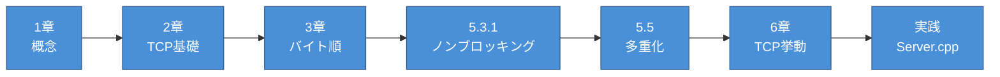
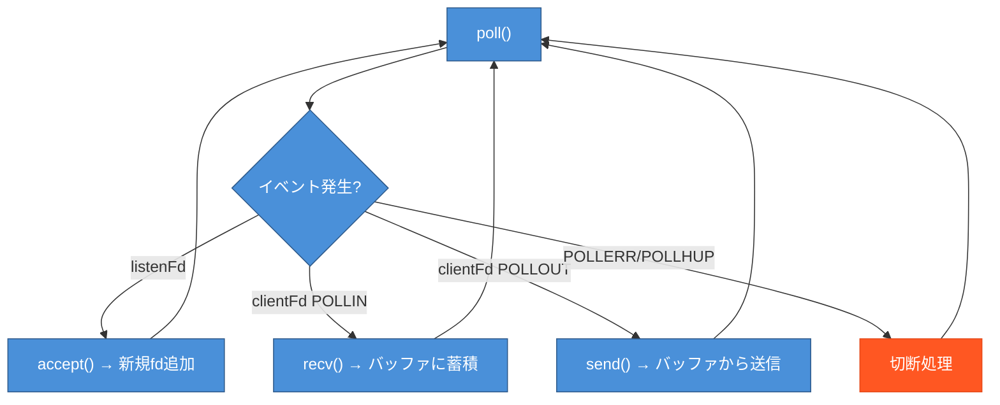

# 読書ガイド: A担当（Network / IO）

> 対象: A担当（Server, Connection, Poller）
> 作成日: 2026-05-23
> ステータス: 確定

---

## 概要

A担当は書籍「TCP/IPソケットプログラミング C言語編」が**最も重要**。
ソケット操作、ノンブロッキングI/O、poll()による多重化を担当する。

---

## 書籍の学習順序



---

## 読むべき章・節（詳細）

| 優先度 | 章/節 | 内容 | 時間目安 | チェック |
|--------|-------|------|----------|----------|
| ★★★ | **2章 全体** | socket/bind/listen/accept/send/recv | 3h | [ ] |
| ★★★ | **5.5 多重化** | select()の概念 → poll()へ読み替え | 3h | [ ] |
| ★★☆ | **5.3.1 ノンブロッキングソケット** | fcntl(O_NONBLOCK), EAGAIN | 2h | [ ] |
| ★★☆ | **6.1 TCPにおけるバッファリング** | send/recvバッファの仕組み | 1h | [ ] |
| ★★☆ | **6.4 TCPソケットのライフサイクル** | 3-wayハンドシェイク、切断検知 | 1h | [ ] |
| ★☆☆ | 1章 全体 | TCP/IP基礎概念 | 1h | [ ] |
| ★☆☆ | 3.1-3.2 | htons/ntohs、バイト順 | 1h | [ ] |

---

## スキップする章・節

| 章/節 | 理由 |
|-------|------|
| **第4章 全体** | UDP。ft_ircはTCPのみ |
| 5.3.2 非同期I/O | SIGIO。poll()を使う |
| 5.3.3 タイムアウト | setsockopt。ノンブロッキング+poll()で対応 |
| 5.4.1-5.4.2 | fork/thread。ft_ircはfork禁止 |
| 5.6 | ブロードキャスト/マルチキャスト。IRC不要 |
| 第7章 | DNS。必須ではない |

---

## サンプルコード対応

### 読むべきコード

| ファイル | 内容 | URL |
|---------|------|-----|
| TCPEchoServer.c | socket/bind/listen/accept基礎 | [Link](http://cs.baylor.edu/~donahoo/practical/CSockets/code/TCPEchoServer.c) |
| HandleTCPClient.c | recv/send基礎 | [Link](http://cs.baylor.edu/~donahoo/practical/CSockets/code/HandleTCPClient.c) |
| TCPEchoServer-Select.c | 多重化の概念 | [Link](http://cs.baylor.edu/~donahoo/practical/CSockets/code/TCPEchoServer-Select.c) |

### スキップするコード

UDP系、Fork系、Thread系、SIGIO系、Broadcast/Multicast系

---

## 最重要: myIRCd/src/Server.cpp

**書籍には poll() のサンプルがない。** 代わりに `myIRCd/src/Server.cpp` を教材として使う。

### Server.cpp が書籍の内容をカバー

| 書籍の章 | Server.cpp の該当部分 |
|---------|---------------------|
| 2章: ソケット基礎 | `setupSocket()` |
| 2章: accept | `acceptNewClient()` |
| 2章: send/recv | `receiveData()`, `sendData()` |
| 3章: バイト順 | `htons(_port)` |
| 5章: ノンブロッキング | `fcntl(fd, F_SETFL, O_NONBLOCK)` |
| 5章: 多重化 | `ircLoop()` の `poll()` |
| 6章: バッファリング | `_recvBuffers`, `_sendBuffers` |
| 6章: 切断検知 | `POLLERR | POLLHUP | POLLNVAL` |

---

## 重要な概念図

### 送受信バッファ

```
アプリケーション（ユーザー空間）
        │
        │ send(fd, data, len, 0)
        ▼
┌─────────────────────────────┐
│  カーネル空間                 │
│  ┌───────────────────────┐  │
│  │ TCP送信バッファ         │  │  ← send()でここにコピー
│  └───────────────────────┘  │
│        │                    │
│        │ カーネルが送信       │
│        ▼                    │
│    ネットワーク               │
└─────────────────────────────┘
```

### poll() ループの流れ



---

## リソース

| リソース | URL |
|---------|-----|
| オーム社 書籍ページ | https://www.ohmsha.co.jp/book/9784274065194/ |
| 原著者サンプルコード | http://cs.baylor.edu/~donahoo/practical/CSockets/textcode.html |
| man poll | `man 2 poll` |
| myIRCd/src/Server.cpp | ローカル |
