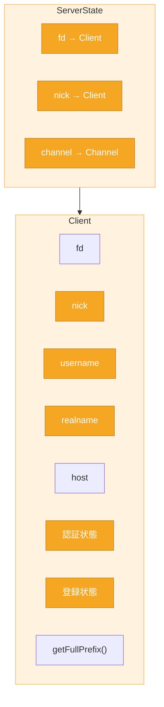

# 読書ガイド: C1担当（Client / ServerState）

> 対象: C1担当（Client, ServerState, ClientRegistry）  
> 作成日: 2026-05-23  
> 更新日: 2026-06-01  
> 更新者: torinoue  
> ステータス: **次回セッションで詳細化予定**

---

## 概要

C1担当はクライアント状態管理とサーバー全体の辞書管理を担当。
ソケット書籍は**直接関係しない**。

---

## 書籍との関係

**ソケット書籍は不要。** design.md と RFC を読むこと。

---

## 主要リソース

| リソース | 該当箇所 | 内容 |
|---------|----------|------|
| design.md | Section 3.3, 5, 6 | Client/ServerStateの責務、辞書管理ルール |
| [`class_overview_diagram.md`](../diagrams/class_overview_diagram.md), [`interface.md`](../interface.md) §4, [`b_implementation_reader.md`](../b_implementation_reader.md) §7 | — | Client/ServerState 公開 API・契約・呼び出し元 |
| [RFC 1459](https://www.rfc-editor.org/rfc/rfc1459) | Section 4.1 | PASS/NICK/USER（登録フロー） |
| [RFC 2812](https://www.rfc-editor.org/rfc/rfc2812) | Section 3.1 | 登録コマンド詳細 |

### コマンド別RFCセクション

| コマンド | [RFC 1459](https://www.rfc-editor.org/rfc/rfc1459) | [RFC 2812](https://www.rfc-editor.org/rfc/rfc2812) |
|----------|----------|----------|
| PASS | [4.1.1](https://www.rfc-editor.org/rfc/rfc1459#section-4.1.1) | [3.1.1](https://www.rfc-editor.org/rfc/rfc2812#section-3.1.1) |
| NICK | [4.1.2](https://www.rfc-editor.org/rfc/rfc1459#section-4.1.2) | [3.1.2](https://www.rfc-editor.org/rfc/rfc2812#section-3.1.2) |
| USER | [4.1.3](https://www.rfc-editor.org/rfc/rfc1459#section-4.1.3) | [3.1.3](https://www.rfc-editor.org/rfc/rfc2812#section-3.1.3) |
| QUIT | [4.1.6](https://www.rfc-editor.org/rfc/rfc1459#section-4.1.6) | [3.1.7](https://www.rfc-editor.org/rfc/rfc2812#section-3.1.7) |

---

## 担当クラス
| クラス | 役割 |
|--------|------|
| Client | ユーザー固有情報、認証状態、登録状態 |
| ServerState | fd/nick/channel辞書の集中管理 |
| ClientRegistry | （必要に応じて分離）Client辞書管理 |



---

## 重要なルール

### 【実装】nick変更ルール

```cpp
// NG: 辞書が更新されない
client.setNick(newNick);

// OK: ServerState経由で辞書も更新
state.updateNick(client, newNick);
```

### 【設計】Client削除ルール（IRCの一般的動作を反映）

`ServerState::removeClient()` を通すこと。以下を自動処理：
- 全Channelからmember登録削除
- operator集合から削除
- invited listから削除
- 空Channelの削除
- fd/nick辞書の更新

---

## TODO: 次回セッションで詳細化

- [ ] RFC 1459/2812 の C1 関連セクション特定
- [ ] 登録フロー（PASS → NICK → USER）の詳細整理
- [ ] 状態遷移図の作成
- [ ] C1担当向けクイズ作成
