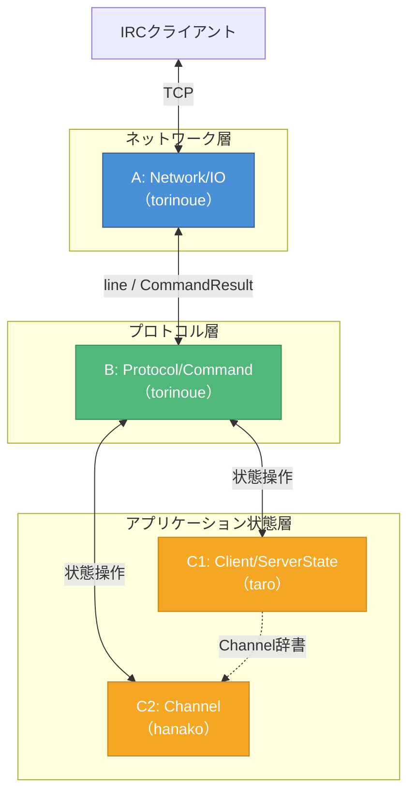
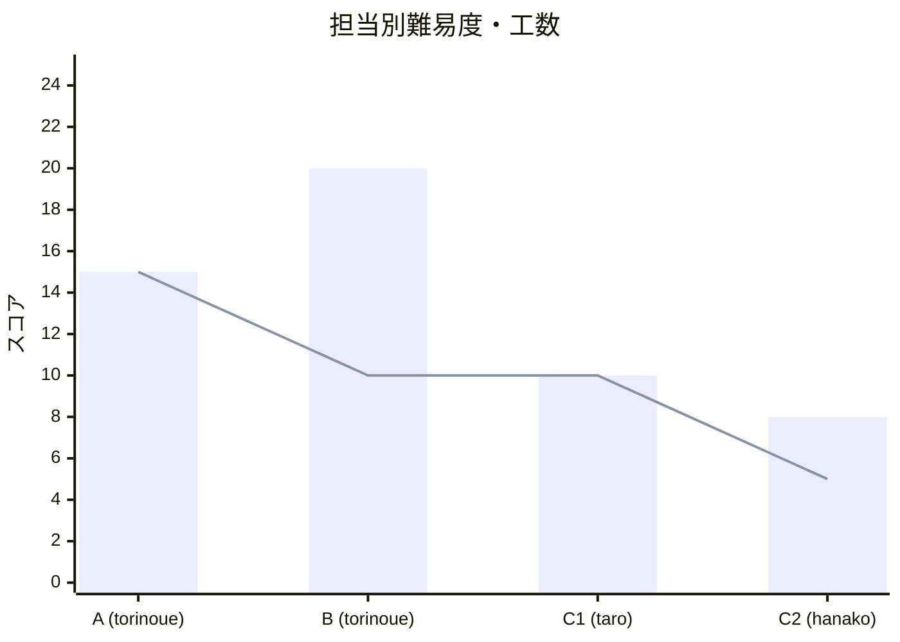
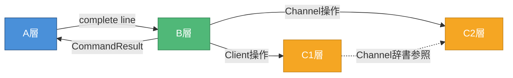

# チーム役割分担

> 作成日: 2026-05-23
> 用途: MTG資料（taro/hanako向け役割説明）

---

## チーム構成

| メンバー | 担当 | 範囲 |
|---------|------|------|
| **torinoue** | A + B | Network/IO + Protocol/Command |
| **taro** | C1 | Client / ServerState |
| **hanako** | C2 | Channel / ChannelModes |

---

## アーキテクチャ概要

---

## 担当別詳細

### A層: Network/IO（torinoue）

| 項目 | 内容 |
|------|------|
| **クラス** | Server, Connection (+Poller, ConnectionManager) |
| **責務** | socket, poll(), recv/send, バッファ管理 |
| **難易度** | ★★★ |
| **工数** | 約15h |
| **技術要素** | ノンブロッキングI/O, poll(), partial read/write |

---

### B層: Protocol/Command（torinoue）

| 項目 | 内容 |
|------|------|
| **クラス** | Parser, Message, CommandDispatcher, ReplyBuilder |
| **責務** | IRCメッセージ解析、コマンド実行、返信生成 |
| **難易度** | ★★☆ |
| **工数** | 約20h |
| **技術要素** | RFC 1459/2812理解、Numeric Reply |

---

### C1層: Client/ServerState（taro）

| 項目 | 内容 |
|------|------|
| **クラス** | Client, ServerState (+ClientRegistry) |
| **責務** | ユーザー状態管理、fd/nick/channel辞書管理 |
| **難易度** | ★★☆ |
| **工数** | 約10h |
| **技術要素** | std::map操作、辞書整合性、状態遷移 |

**主要な責務:**
- Client: nick, username, 認証/登録状態の保持
- ServerState: fd→Client, nick→Client, channel→Channel の辞書管理
- nick変更時の辞書同期
- Client削除時の全Channel参照クリーンアップ

---

### C2層: Channel（hanako）

| 項目 | 内容 |
|------|------|
| **クラス** | Channel, ChannelModes (+ChannelService) |
| **責務** | チャンネル状態管理、モード管理 |
| **難易度** | ★☆☆ |
| **工数** | 約8h |
| **技術要素** | std::set操作、モードフラグ管理 |

**主要な責務:**
- Channel: members, operators, invited, topic の管理
- ChannelModes: +i, +t, +k, +l フラグ管理
- 新規Channel作成時のoperator bootstrap
- JOIN/KICK/INVITE/TOPIC/MODE のChannel側ロジック

---

## 難易度比較

| 担当 | 工数(h) | 難易度 | コメント |
|------|--------|--------|---------|
| A | 15h | ★★★ | poll/バッファが難所 |
| B | 20h | ★★☆ | 量が多い、RFC理解必要 |
| C1 | 10h | ★★☆ | 辞書整合性に注意 |
| C2 | 8h | ★☆☆ | 比較的シンプル |

---

## 依存関係

**ポイント:**
- C1とC2は**並行作業可能**
- A→B→C の順に依存があるが、インターフェースを先に合意すれば並行開発可能
- 最終統合はB層（CommandDispatcher）で行われる

---

## 並行作業可能範囲

| フェーズ | torinoue | taro | hanako |
|---------|----------|------|--------|
| Phase 1 | Server基盤, Parser | Client | Channel |
| Phase 2 | Connection, Dispatcher | ServerState | ChannelModes |
| Phase 3 | 統合・結合 | レビュー支援 | レビュー支援 |
| Phase 4 | コマンド実装 | テスト支援 | テスト支援 |

**Phase 1-2はほぼ全員並行作業可能。**

---

## 各担当の最初のステップ

### taro（C1）
1. `onboarding_C1.md` を読む
2. `design.md` Section 3.3, 5, 6 を読む
3. `interface.md` Section 7 を読む
4. Client クラスのスケルトンを作成

### hanako（C2）
1. `onboarding_C2.md` を読む
2. `design.md` Section 3.4, 7 を読む
3. `interface.md` Section 8 を読む
4. Channel クラスのスケルトンを作成

---

## 質問先

- 設計全般: torinoue
- インターフェース確認: `interface.md` → 不明点はtorinoue
- IRC仕様: RFC 1459/2812 → 不明点はtorinoue

---

## 色凡例

| 色 | 意味 |
|----|------|
| 🔵 青 | A層: Network/IO |
| 🟢 緑 | B層: Protocol/Command |
| 🟠 オレンジ | C1/C2層: アプリケーション状態 |
