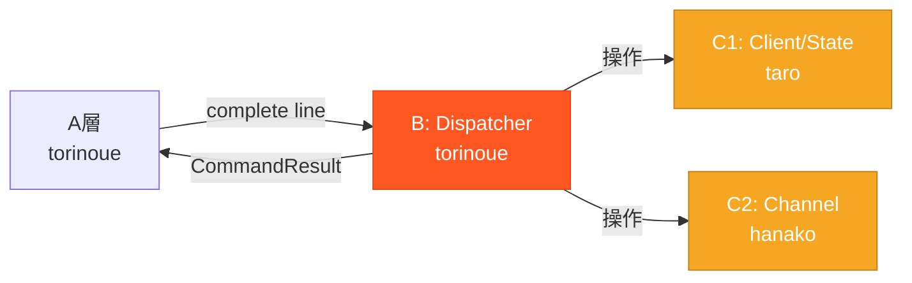

# スタブ作成提案

> **作成日**: 2026-05-23
> **ステータス**: 📋 提案（検討用）
> **関連**: [interface_confirmed_20260523.md](./interface_confirmed_20260523.md)

---

## 1. 背景

### 現在の依存関係



### 問題

- B層（Dispatcher）がC1/C2のインターフェースを呼び出す
- torinoue（B担当）がDispatcherを開発・テストするには、C1/C2の実装が必要
- **C1/C2完了待ちでB層開発が遅延する可能性**

---

## 2. 提案: C1/C2スタブの作成

### スタブとは

- インターフェースは本物と同じ
- 内部実装は固定値を返すだけ
- B層の開発・テスト用

### 作成対象

| クラス | 担当 | スタブ作成者 |
|--------|------|------------|
| Client | C1 (taro) | torinoue |
| ServerState | C1 (taro) | torinoue |
| Channel | C2 (hanako) | torinoue |
| ChannelModes | C2 (hanako) | torinoue |

---

## 3. スタブ仕様

### 3.1 Client スタブ

```cpp
class ClientStub {
private:
    int         _fd;
    std::string _nick;
    std::string _username;
    std::string _realname;
    std::string _host;
    bool        _passOk;
    bool        _registered;

public:
    ClientStub(int fd) 
        : _fd(fd), _nick("stub_user"), _username("stub"), 
          _realname("Stub User"), _host("127.0.0.1"), 
          _passOk(false), _registered(false) {}

    int getFd() const { return _fd; }
    const std::string& getNick() const { return _nick; }
    const std::string& getUsername() const { return _username; }
    const std::string& getRealname() const { return _realname; }
    const std::string& getHost() const { return _host; }
    std::string getFullPrefix() const { return _nick + "!" + _username + "@" + _host; }
    
    void setUsername(const std::string& u) { _username = u; }
    void setRealname(const std::string& r) { _realname = r; }
    void setHost(const std::string& h) { _host = h; }
    void setPassOk(bool ok) { _passOk = ok; }
    bool isPassOk() const { return _passOk; }
    bool isRegistered() const { return _registered; }
    bool canRegister() const { return _passOk && !_nick.empty() && !_username.empty(); }
    void markRegistered() { _registered = true; }
};
```

**工数**: 約1h

---

### 3.2 ServerState スタブ

```cpp
class ServerStateStub {
private:
    std::string _password;
    std::map<int, Client*> _clients;
    std::map<std::string, Client*> _nickMap;
    std::map<std::string, Channel*> _channels;

public:
    ServerStateStub(const std::string& pw) : _password(pw) {}
    
    const std::string& password() const { return _password; }
    
    void addClient(int fd) {
        _clients[fd] = new Client(fd);
    }
    
    void removeClient(int fd) {
        if (_clients.find(fd) != _clients.end()) {
            delete _clients[fd];
            _clients.erase(fd);
        }
    }
    
    Client* getClientByFd(int fd) {
        return _clients.count(fd) ? _clients[fd] : NULL;
    }
    
    Client* getClientByNick(const std::string& nick) {
        return _nickMap.count(nick) ? _nickMap[nick] : NULL;
    }
    
    bool nickExists(const std::string& nick) const {
        return _nickMap.count(nick) > 0;
    }
    
    void updateNick(Client& client, const std::string& newNick) {
        // 簡易実装: 辞書更新のみ
        _nickMap.erase(client.getNick());
        // client.setNick(newNick); // 本実装で有効化
        _nickMap[newNick] = &client;
    }
    
    Channel* getChannel(const std::string& name) {
        return _channels.count(name) ? _channels[name] : NULL;
    }
    
    Channel* getOrCreateChannel(const std::string& name) {
        if (!_channels.count(name)) {
            _channels[name] = new Channel(name);
        }
        return _channels[name];
    }
    
    void removeChannelIfEmpty(const std::string& name) {
        if (_channels.count(name) && _channels[name]->isEmpty()) {
            delete _channels[name];
            _channels.erase(name);
        }
    }
};
```

**工数**: 約1.5h

---

### 3.3 Channel スタブ

```cpp
class ChannelStub {
private:
    std::string _name;
    std::string _topic;
    std::set<Client*> _members;
    std::set<Client*> _operators;
    std::set<Client*> _invited;
    ChannelModes _modes;

public:
    ChannelStub(const std::string& name) : _name(name) {}
    
    const std::string& name() const { return _name; }
    
    bool hasMember(Client* c) const { return _members.count(c) > 0; }
    void addMember(Client* c) { _members.insert(c); }
    void removeMember(Client* c) { _members.erase(c); }
    
    void removeClient(Client* c) {
        _members.erase(c);
        _operators.erase(c);
        _invited.erase(c);
    }
    
    std::vector<Client*> members() const {
        return std::vector<Client*>(_members.begin(), _members.end());
    }
    
    size_t memberCount() const { return _members.size(); }
    
    bool isOperator(Client* c) const { return _operators.count(c) > 0; }
    void addOperator(Client* c) { _operators.insert(c); }
    void removeOperator(Client* c) { _operators.erase(c); }
    
    void invite(Client* c) { _invited.insert(c); }
    bool isInvited(Client* c) const { return _invited.count(c) > 0; }
    void removeInvite(Client* c) { _invited.erase(c); }
    
    void setTopic(const std::string& t) { _topic = t; }
    const std::string& topic() const { return _topic; }
    
    ChannelModes& modes() { return _modes; }
    const ChannelModes& modes() const { return _modes; }
    
    bool isEmpty() const { return _members.empty(); }
};
```

**工数**: 約1h

---

### 3.4 ChannelModes スタブ

```cpp
class ChannelModesStub {
private:
    bool _inviteOnly;
    bool _topicRestricted;
    std::string _key;
    int _limit;

public:
    ChannelModesStub() 
        : _inviteOnly(false), _topicRestricted(false), _limit(-1) {}
    
    bool inviteOnly() const { return _inviteOnly; }
    bool topicRestricted() const { return _topicRestricted; }
    bool hasKey() const { return !_key.empty(); }
    const std::string& key() const { return _key; }
    int limit() const { return _limit; }
    
    void setInviteOnly(bool v) { _inviteOnly = v; }
    void setTopicRestricted(bool v) { _topicRestricted = v; }
    void setKey(const std::string& k) { _key = k; }
    void unsetKey() { _key.clear(); }
    void setLimit(int l) { _limit = l; }
    void unsetLimit() { _limit = -1; }
};
```

**工数**: 約0.5h

---

## 4. 工数まとめ

| スタブ | 工数 |
|--------|------|
| Client | 1h |
| ServerState | 1.5h |
| Channel | 1h |
| ChannelModes | 0.5h |
| **合計** | **4h** |

---

## 5. 効果

| 効果 | 説明 |
|------|------|
| **B層の早期開発** | C1/C2完了を待たずにDispatcherをテスト可能 |
| **インターフェース検証** | 実装前にinterface.mdの問題を発見 |
| **統合リスク低減** | 「つないだら動かない」を防ぐ |
| **並行度向上** | クリティカルパスの待ち時間削減 |

---

## 6. コスト対効果

| 項目 | 値 |
|------|-----|
| スタブ作成コスト | 4h |
| 期待短縮効果 | 0〜6h |
| リスク低減効果 | **高** |
| **総合判断** | **やる価値あり** |

---

## 7. 実施判断

### やる場合

1. torinoueがスタブを作成（4h）
2. スタブを `myIRCd/src/stubs/` に配置
3. taro/hanakoは本実装を進める
4. 本実装完了後、スタブから本物に差し替え

### やらない場合

1. taro/hanakoが先にスケルトン（空実装）を作成
2. torinoueはスケルトン完成後にDispatcher開発
3. 統合時に問題が見つかる可能性あり

---

## 8. 決定事項

| 項目 | 決定 | 日付 |
|------|------|------|
| スタブ作成 | 未決定 | - |

---

## 関連ドキュメント

- [interface_confirmed_20260523.md](./interface_confirmed_20260523.md) - インターフェース確定版
- [timeline_diagram.md](./diagrams/timeline_diagram.md) - 実装タイムライン
