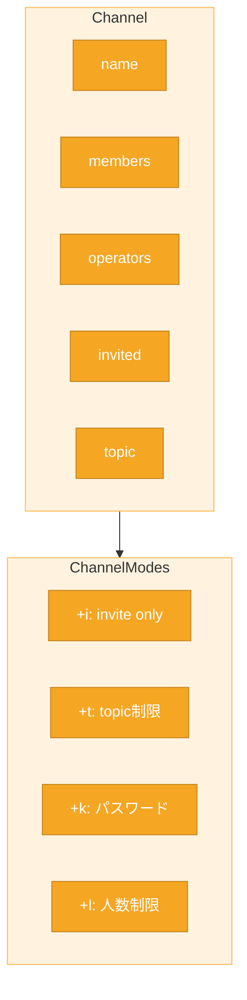

# 読書ガイド: C2担当（Channel）

> 対象: C2担当（Channel, ChannelModes, ChannelService）
> 作成日: 2026-05-23
> ステータス: **次回セッションで詳細化予定**

---

## 概要

C2担当はチャンネル管理を担当。
ソケット書籍は**直接関係しない**。

---

## 書籍との関係

**ソケット書籍は不要。** design.md と RFC を読むこと。

---

## 主要リソース

| リソース | 該当箇所 | 内容 |
|---------|----------|------|
| design.md | Section 3.4, 7 | Channel/ChannelModesの責務 |
| interface.md | Section 9, 10 | Channel, ChannelModesの関数仕様 |
| RFC 1459 | Section 1.3, 4.2 | チャンネル仕様、JOIN/PART/KICK等 |
| RFC 2812 | Section 3.2 | チャンネルコマンド詳細 |

---

## 担当クラス



| クラス | 役割 |
|--------|------|
| Channel | チャンネル状態（members, operators, topic等） |
| ChannelModes | モード状態（+i, +t, +k, +l） |
| ChannelService | （必要に応じて分離）Channel操作ロジック |

---

## 重要なルール

### Operator管理

**operatorはClientではなくChannelが管理する。**

理由: 1人のClientが複数Channelで異なる権限を持てる。

```
Channel #foo
├─ members: [Alice, Bob, Carol]
└─ operators: [Alice]        ← Aliceは#fooでoperator

Channel #bar
├─ members: [Alice, Bob]
└─ operators: [Bob]          ← Aliceは#barではoperatorではない
```

### Operator Bootstrap

新規Channel作成時、最初のJOIN者が自動的にoperatorになる。

---

## TODO: 次回セッションで詳細化

- [ ] RFC 1459/2812 の C2 関連セクション特定
- [ ] 各モード（+i, +t, +k, +l, +o）の詳細整理
- [ ] JOIN/KICK/INVITE/TOPIC/MODE の処理フロー
- [ ] C2担当向けクイズ作成
