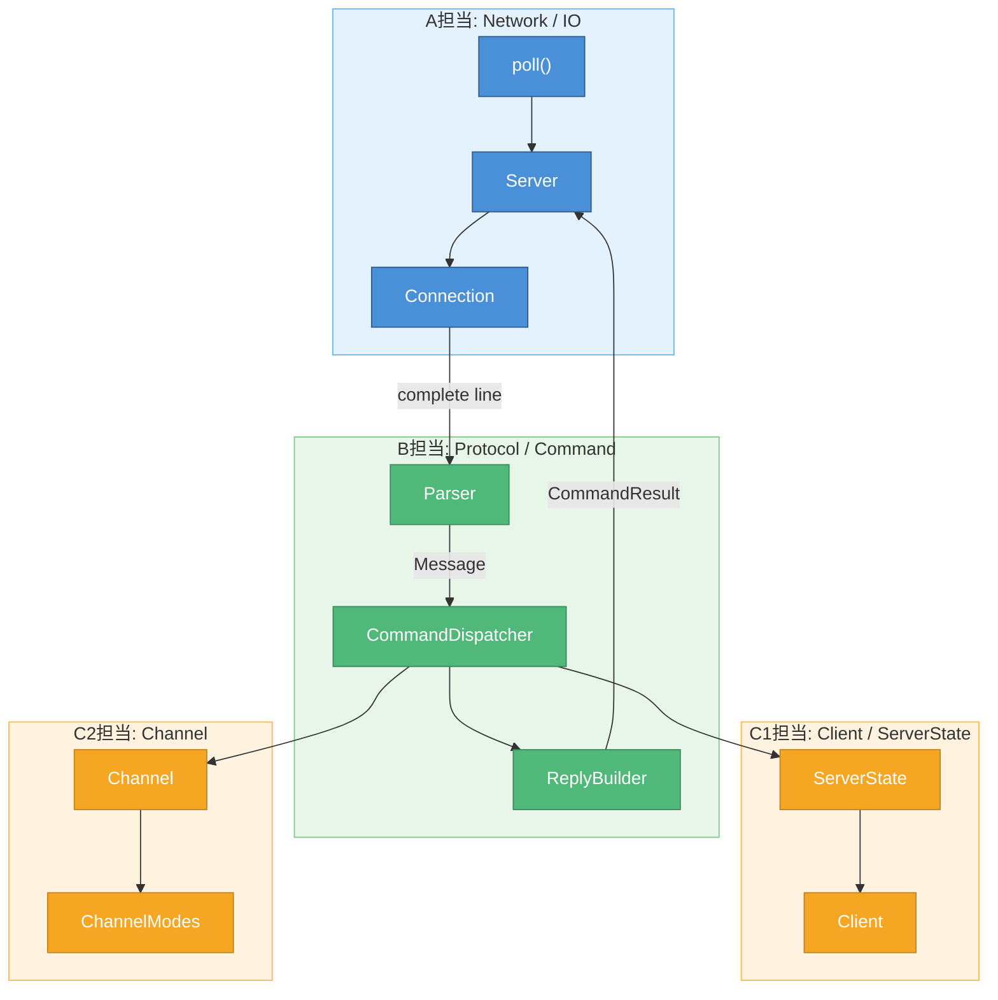
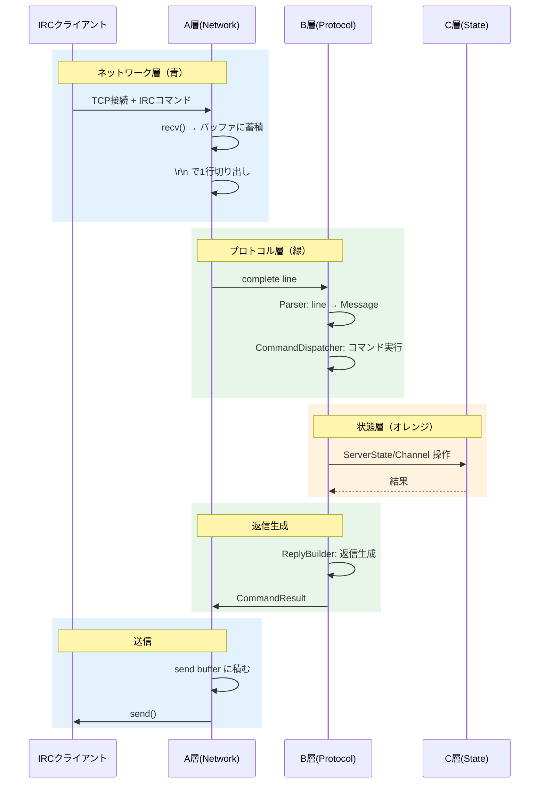

# 読書ガイド: 共通

> 対象: 全担当者（A, B, C1, C2）
> 作成日: 2026-05-23
> ステータス: 確定

---

## 共通で理解すべき概念

### 1. TCP/IP 基礎（書籍 第1章）

全員が最低限理解すべき概念：

| 概念 | 説明 |
|------|------|
| TCP vs UDP | TCP: 信頼性あり、コネクション型 / UDP: 信頼性なし、コネクションレス |
| IPアドレス | ホスト（マシン）を特定 |
| ポート番号 | ホスト内のプロセスを特定 |
| クライアント/サーバー | 接続を開始する側 / 待ち受ける側 |

### 2. ft_irc の全体構成

### 3. データの流れ

---

## 共通リソース

| リソース | 用途 |
|---------|------|
| [design.md](../../myIRCd/docs/design.md) | 全体設計、責務分割 |
| [interface.md](../../myIRCd/docs/interface.md) | 各クラスのインターフェース |
| [RFC 1459](https://datatracker.ietf.org/doc/html/rfc1459) | IRCプロトコル基本仕様 |
| [RFC 2812](https://datatracker.ietf.org/doc/html/rfc2812) | IRCクライアントプロトコル詳細 |

---

## 担当別ガイドへのリンク

- [A担当（Network/IO）](./reading_guide_A.md) - ★書籍メイン
- [B担当（Protocol/Command）](./reading_guide_B.md)
- [C1担当（Client/ServerState）](./reading_guide_C1.md)
- [C2担当（Channel）](./reading_guide_C2.md)
