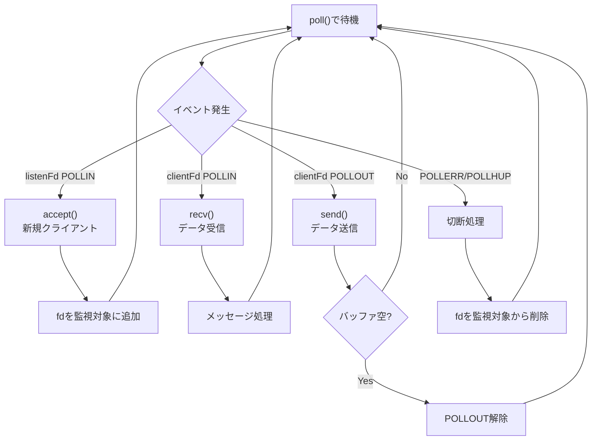

# セッションログ #0003

> 日付: 2026-05-22 〜 2026-05-23
> 開始時刻: 2026-05-22 20:45 JST
> 終了時刻: 2026-05-23 21:12 JST
> 実稼働時間: 6h
> セッション種別: ソケット書籍 学習計画策定
> 対応フェーズ: 1（ソケットプログラミング学習）
> **参加者: torinoue（sohyamaz, atashiro 不在）**

---

## 完了タスク

### 書籍学習計画

- [x] 書籍「TCP/IPソケットプログラミング C言語編」の読むべき箇所分析
- [x] 担当別（A, B, C1, C2）の学習リソース整理
- [x] スキップしてよい章・節の特定（UDP, fork, thread, SIGIO等）
- [x] phase_plan.md 更新（学習計画詳細化、URL追加）

### ドキュメント作成

- [x] `reading_guide_common.md` - 全担当者共通ガイド
- [x] `reading_guide_A.md` - A担当（Network/IO）向け ★書籍メイン
- [x] `reading_guide_B.md` - B担当（Protocol/Command）向け
- [x] `reading_guide_C1.md` - C1担当（Client/ServerState）向け
- [x] `reading_guide_C2.md` - C2担当（Channel）向け

### bircd 分析・学習カリキュラム

- [x] `bircd_analysis.md` - 課題添付サンプル（bircd/）の構造分析
- [x] `bircd_learning_curriculum.md` - bircd から Server.cpp 相当を作成するための学習プラン（10-14時間）

### 発見・確認事項

- [x] 書籍に poll() サンプルがないことを確認
- [x] myIRCd/src/Server.cpp が poll() の実践教材として使えることを確認
- [x] select() vs poll() の違いと選定理由の整理
- [x] bircd は select() ベースで部分データ処理なし → 学習教材としては Server.cpp を優先

---

## 学習内容

### 書籍の構成と ft_irc との関係

| 章 | 内容 | ft_irc関連度 |
|----|------|-------------|
| 1章 | ネットワーク概念 | ★☆☆ 全員基礎 |
| 2章 | ソケット基礎 | ★★★ A担当必須 |
| 3章 | メッセージ作成 | ★★☆ A担当 |
| 4章 | UDP | ☆☆☆ スキップ |
| 5章 | ソケットプログラミング | ★★★ A担当必須 |
| 6章 | ソケットAPIの舞台裏 | ★★☆ A担当 |
| 7章 | DNS | ☆☆☆ スキップ |

### 担当と学習リソースの対応

| 担当 | 主な学習リソース | 書籍必要度 |
|------|-----------------|-----------|
| A (Network/IO) | **書籍 + Server.cpp** | ★★★ 必須 |
| B (Protocol/Command) | RFC 1459/2812, interface.md | ☆ 背景知識程度 |
| C1 (Client/ServerState) | design.md, RFC | ☆ 不要 |
| C2 (Channel) | design.md, RFC | ☆ 不要 |

### select() vs poll() の比較

| 項目 | select() | poll() |
|------|----------|--------|
| fd数上限 | FD_SETSIZE (1024) | なし |
| macOS | ✅ | ✅ |
| Ubuntu | ✅ | ✅ |
| 書籍サンプル | あり | **なし** |
| ft_irc推奨 | - | **★推奨** |

書籍が select() を使う理由: 2003年当時、Windowsで poll() 未サポートだったため。

### TCP バッファリングの理解

```
送信側                              受信側
┌────────────┐                     ┌────────────┐
│ アプリ     │                     │ アプリ     │
│ send()     │                     │ recv()     │
└─────┬──────┘                     └─────▲──────┘
      │                                  │
      ▼                                  │
┌─────────────┐                   ┌─────────────┐
│ 送信バッファ │  ───ネット───▶   │ 受信バッファ │
│ (カーネル)   │                   │ (カーネル)   │
└─────────────┘                   └─────────────┘
```

- `send()` 成功 ≠ 相手に届いた（カーネルバッファにコピーされただけ）
- TCPはバイトストリーム → メッセージ境界は保持されない → アプリで `\r\n` 切り出し必要

### poll() ループの流れ



### Server.cpp と書籍の対応

| 書籍の章 | Server.cpp の該当部分 |
|---------|---------------------|
| 2章: ソケット基礎 | `setupSocket()` |
| 2章: accept | `acceptNewClient()` |
| 2章: send/recv | `receiveData()`, `sendData()` |
| 3章: バイト順 | `htons(_port)` |
| 5章: ノンブロッキング | `fcntl(fd, F_SETFL, O_NONBLOCK)` |
| 5章: 多重化 | `ircLoop()` の `poll()` |
| 6章: バッファリング | `_recvBuffers`, `_sendBuffers` |
| 6章: 切断検知 | `POLLERR | POLLHUP | POLLNVAL` |

---

## Q&A 記録

### Q: UDPの章は読む必要あるか？
**A: 不要。** ft_ircはTCPのみ。第4章は全スキップ。

### Q: 5.3.3 タイムアウトは読む必要あるか？
**A: 不要。** setsockoptでのタイムアウト設定はブロッキングソケット向け。ft_ircはノンブロッキング+poll()。

### Q: poll()のサンプルはどこにあるか？
**A: 書籍には存在しない。** myIRCd/src/Server.cpp を使う。

### Q: なぜ書籍は select() を使っているのか？
**A: 2003年当時の移植性。** Windows で poll() が未サポートだった。

### Q: 受信キューとは何か？
**A: カーネルのTCP受信バッファ。** ネットワークから届いたデータをFIFOで溜める場所。

### Q: FIFOとLIFOの違いは？
**A: 取り出し位置。** FIFO（キュー）は先頭から、LIFO（スタック）は末尾から。

---

## 更新したファイル

| ファイル | 変更内容 |
|---------|---------|
| phase_plan.md | 書籍URL追加、学習計画詳細化 |
| reading_guide_common.md | 新規作成 |
| reading_guide_A.md | 新規作成 |
| reading_guide_B.md | 新規作成 |
| reading_guide_C1.md | 新規作成 |
| reading_guide_C2.md | 新規作成 |
| bircd_analysis.md | 新規作成 - bircd 構造分析 |
| bircd_learning_curriculum.md | 新規作成 - bircd 学習カリキュラム（Phase 1-5） |

---

## 次回やること

- [ ] C1, C2 が読むべき RFC の項目を詳細分析
- [ ] C1, C2 向けチェックリスト作成
- [ ] C1, C2 向けクイズ作成
- [ ] reading_guide_B.md, reading_guide_C1.md, reading_guide_C2.md の詳細化

---

## 新しいチャット開始時のコピペ用指示文

```
ft_irc課題（42Tokyo）を進めています。
チーム: torinoue, sohyamaz, atashiro

以下を読んで現在地を把握してから作業を始めてください:
- myIRCd/docs/design.md（設計ドキュメント）
- myIRCd/docs/interface.md（インターフェース定義）
- IRC_torinoue/dev_docs/phase_plan.md（全体計画）
- IRC_torinoue/dev_docs/reading_guide_*.md（担当別読書ガイド）
- IRC_torinoue/dev_docs/bircd_analysis.md（課題サンプル bircd 分析）
- IRC_torinoue/dev_docs/bircd_learning_curriculum.md（bircd 学習カリキュラム）
- IRC_torinoue/session_logs/0003_session_log_ft_irc.md（前回セッションログ）

担当: B（Protocol / Command）
前回: 書籍学習計画策定、担当別reading_guide作成
今日やること: C1, C2が読むべきRFCの項目分析、チェックリスト・クイズ作成
```
